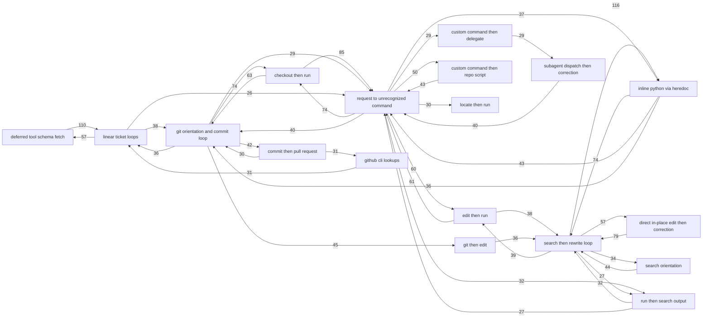

# Automation Candidates

A network of candidate workflows for internal MSP developer tooling, derived from observed
Claude Code session behavior. Generated by `comb/`; see
`docs/superpowers/specs/2026-09-14-comb-ontology-design.md`.

**This file is generated.** Edit `comb/ontology.json` through the CLI, never by hand:
`bun comb/ontology.mjs status N001 built`. `Status` is human-owned and survives every run.

**`Distinct projects` is a count, never engagement names.** Nodes seen in one project get a
mechanical description only.

_Last run: 2026-09-14 · corpus: 10420 steps / 216 sessions / 68 project dirs · 39 nodes · 179 flow edges · 12 motifs waiting_

## Themes

Labels the skill assigns per node with `annotate --theme`.

| Theme | Nodes | Friction share |
|---|---|---|
| linear | 1 | 26% |
| unrecognized commands | 8 | 20% |
| git | 3 | 18% |
| delegation | 3 | 10% |
| ad-hoc python | 2 | 8% |
| editing | 5 | 7% |
| tool schemas | 3 | 5% |
| correction | 5 | 4% |
| orientation | 3 | 2% |
| mcp bulk | 3 | 0% |
| skills | 3 | 0% |

## Candidates

| ID | Name | Theme | Motifs | Occurrences | Distinct projects | Median time | Correction | Class | Type | Status | Candidate tool |
|---|---|---|---|---|---|---|---|---|---|---|---|
| `N002` | request to unrecognized command | unrecognized commands | 29 | 908 | 43 | 48s | 19% | tool | script | new | Widen the vocabulary for the commands behind this node so they can be named, then split it into real candidates. |
| `N004` | linear ticket loops | linear | 46 | 1266 | 30 | 8s | 12% | tool | mcp | new | A bulk ticket upsert with a preview-before-write step, paired with the Linear project-management skills. |
| `N003` | git orientation and commit loop | git | 20 | 635 | 38 | 28s | 18% | tool | hook | new | A session-start repo primer plus a scripted commit-and-verify path enforced by a hook. |
| `N011` | subagent dispatch then correction | delegation | 13 | 376 | 13 | 169s | 31% | tool | harness | new | Named subagent types with a tighter brief and return contract instead of ad-hoc general-purpose dispatch. |
| `N006` | inline python via heredoc | ad-hoc python | 31 | 780 | 36 | 18s | 9% | tool | script | new | A checked data-inspection helper (query, shape, diff) that replaces ad-hoc heredoc Python with one call. |
| `N010` | direct in-place edit then correction | editing | 11 | 220 | 22 | 144s | 19% | unclassified | skill | new | The same guarded batch-edit primitive as the search-then-rewrite loop, with preview before apply. |
| `N001` | deferred tool schema fetch | tool schemas | 21 | 457 | 35 | 12s | 6% | doc | harness | new | Preload the hot deferred tools per project in settings so the first action is the work itself. |
| `N015` | github cli lookups | git | 10 | 249 | 18 | 17s | 14% | tool | skill | new | A PR-context summarizer that runs at session start. |
| `N021` | markdown draft then correction | correction | 3 | 57 | 16 | 213s | 26% | tool | skill | new | A document outline-and-approve step before the full write. |
| `N012` | search orientation | orientation | 4 | 99 | 27 | 17s | 10% | unclassified | harness | new | Repo structure notes; shared with the filesystem-orientation node. |
| `N007` | search then rewrite loop | editing | 14 | 413 | 31 | 7s | 7% | tool | skill | new | A guarded batch-edit primitive: match, preview, apply, verify in one step. |
| `N026` | request to repo script | unrecognized commands | 2 | 37 | 11 | 20s | 11% | unclassified | script | new | Add the hot repo scripts to INTERNAL_SCRIPTS so this node can be split by script. |
| `N024` | clarifying question round trip | correction | 2 | 37 | 22 | 171s | 24% | unclassified | harness | new | None; a sign that briefs need sharpening before work starts. |
| `N009` | checkout then run | unrecognized commands | 8 | 200 | 30 | 15s | 20% | unclassified | script | new | Blocked on naming the command; widen the vocabulary first. |
| `N014` | edit then run | unrecognized commands | 8 | 147 | 26 | 21s | 5% | doc | script | new | A runbook once the command is named; the edit half belongs to the batch-edit primitive. |
| `N036` | artifact publish then correction | correction | 1 | 16 | 8 | 213s | 38% | tool | skill | new | A preview-and-approve step before publishing an artifact. |
| `N020` | custom command then repo script | unrecognized commands | 6 | 128 | 17 | 20s | 3% | tool | script | new | Name the repo script in INTERNAL_SCRIPTS, then fold both steps into one validate command. |
| `N034` | run then ask | correction | 2 | 26 | 11 | 45s | 15% | unclassified | harness | new | Blocked on naming the command. |
| `N008` | filesystem orientation | orientation | 3 | 73 | 31 | 10s | 10% | doc | harness | new | Per-repo structure notes in CLAUDE.md or a shared repo-map primer at session start. |
| `N030` | unrecognized tool then correction | correction | 1 | 24 | 8 | 94s | 25% | tool | harness | new | Add the tool to the vocabulary so this node can be named. |
| `N005` | skill invocation handoff | skills | 6 | 186 | 32 | 8s | 5% | doc | harness | new | None yet; treat as a measure of skill usage and revisit if the correction rate rises. |
| `N019` | commit then pull request | git | 4 | 70 | 16 | 15s | 20% | unclassified | script | new | A commit-push-PR script that enforces the house branch and PR conventions. |
| `N029` | custom command then delegate | delegation | 2 | 44 | 7 | 30s | 46% | tool | harness | new | A named subagent with a real brief for the workflow behind this command. |
| `N013` | box document loops | mcp bulk | 5 | 215 | 12 | 4s | 2% | tool | mcp | new | A batch Box list-and-fetch helper. |
| `N016` | run then search output | unrecognized commands | 2 | 59 | 24 | 12s | 14% | unclassified | script | new | A structured-output wrapper for the command once it is named. |
| `N018` | fireflies transcript loops | mcp bulk | 4 | 167 | 14 | 5s | 4% | tool | mcp | new | A batch transcript fetch, or preloading the Fireflies tools so the loop is one call. |
| `N022` | locate then run | unrecognized commands | 4 | 58 | 21 | 9s | 14% | unclassified | script | new | Blocked on naming the command. |
| `N023` | pull request then run | unrecognized commands | 3 | 53 | 14 | 14s | 19% | unclassified | script | new | Blocked on naming the command. |
| `N017` | git then edit | editing | 4 | 71 | 17 | 7s | 6% | doc | skill | new | None; fold into the batch-edit primitive's documentation. |
| `N039` | inline python one-liners | ad-hoc python | 3 | 61 | 16 | 8s | 12% | tool | script | new | The same checked data-inspection helper. |
| `N037` | git then delegate | delegation | 1 | 16 | 8 | 37s | 31% | tool | harness | new | Same as the delegation node: a named subagent with a real brief. |
| `N027` | git then tool schema fetch | tool schemas | 6 | 75 | 17 | 8s | 4% | doc | harness | new | Preload the hot deferred tools; shared with the schema-fetch node. |
| `N033` | python edit streaks | editing | 1 | 108 | 3 | 4s | 0% | tool | skill | new | A multi-file edit primitive, or accept as normal editing. |
| `N028` | search then git | orientation | 2 | 44 | 13 | 9s | 11% | unclassified | harness | new | None on its own; covered by the orientation primer. |
| `N031` | harvest time entry loops | mcp bulk | 1 | 125 | 3 | 3s | 9% | tool | mcp | new | A batch time-entry operation or a CSV-to-Harvest loader. |
| `N038` | markdown edit streaks | editing | 1 | 56 | 4 | 5s | 0% | tool | skill | new | None on its own; pairs with the multi-file edit primitive. |
| `N035` | slack schema fetch and call | tool schemas | 2 | 52 | 10 | 4s | 4% | tool | harness | new | Preload the hot Slack tools per project. |
| `N032` | screenshot review | skills | 1 | 30 | 6 | 0s | 20% | unclassified | harness | new | None; a measurement artifact until the projector distinguishes attachments. |
| `N025` | artifact design skill load | skills | 1 | 17 | 13 | 0s | 0% | unclassified | harness | new | None; a measurement artifact of skill loading. |

## Build order

By `buildScore` = friction mass × (1 + betweenness). Friction mass is an estimate: overlapping motifs inside one session are counted more than once.

| # | Node | Build score | Cumulative friction |
|---|---|---|---|
| 1 | `N002` request to unrecognized command | 190764108 | 17% |
| 2 | `N004` linear ticket loops | 161968119 | 43% |
| 3 | `N003` git orientation and commit loop | 112245067 | 57% |
| 4 | `N011` subagent dispatch then correction | 57495870 | 66% |
| 5 | `N006` inline python via heredoc | 52743810 | 75% |
| 6 | `N010` direct in-place edit then correction | 32732962 | 80% |
| 7 | `N001` deferred tool schema fetch | 26444174 | 85% |
| 8 | `N015` github cli lookups | 21527216 | 88% |
| 9 | `N021` markdown draft then correction | 10462718 | 90% |
| 10 | `N012` search orientation | 9514886 | 92% |

## Flow

Transitions between nodes inside a session. Shown when count ≥ 5 and sessions ≥ 3.

| From | To | Count | Sessions | Median gap |
|---|---|---|---|---|
| `N007` search then rewrite loop | `N006` inline python via heredoc | 116 | 41 | 0s |
| `N001` deferred tool schema fetch | `N004` linear ticket loops | 110 | 59 | 0s |
| `N009` checkout then run | `N002` request to unrecognized command | 85 | 51 | 0s |
| `N010` direct in-place edit then correction | `N007` search then rewrite loop | 79 | 42 | 0s |
| `N002` request to unrecognized command | `N009` checkout then run | 74 | 39 | 0s |
| `N003` git orientation and commit loop | `N009` checkout then run | 74 | 43 | 0s |
| `N006` inline python via heredoc | `N007` search then rewrite loop | 74 | 31 | 15s |
| `N009` checkout then run | `N003` git orientation and commit loop | 63 | 40 | 0s |
| `N014` edit then run | `N002` request to unrecognized command | 61 | 34 | 0s |
| `N002` request to unrecognized command | `N014` edit then run | 60 | 31 | 0s |
| `N004` linear ticket loops | `N001` deferred tool schema fetch | 57 | 27 | 0s |
| `N007` search then rewrite loop | `N010` direct in-place edit then correction | 57 | 26 | 0s |
| `N002` request to unrecognized command | `N020` custom command then repo script | 50 | 16 | 0s |
| `N003` git orientation and commit loop | `N017` git then edit | 45 | 24 | 0s |
| `N012` search orientation | `N007` search then rewrite loop | 44 | 33 | 0s |
| `N006` inline python via heredoc | `N002` request to unrecognized command | 43 | 24 | 61s |
| `N020` custom command then repo script | `N002` request to unrecognized command | 43 | 17 | 8s |
| `N003` git orientation and commit loop | `N019` commit then pull request | 42 | 22 | 0s |
| `N002` request to unrecognized command | `N003` git orientation and commit loop | 40 | 28 | 0s |
| `N011` subagent dispatch then correction | `N002` request to unrecognized command | 40 | 10 | 0s |
| `N007` search then rewrite loop | `N014` edit then run | 39 | 29 | 0s |
| `N004` linear ticket loops | `N003` git orientation and commit loop | 38 | 31 | 19s |
| `N014` edit then run | `N007` search then rewrite loop | 38 | 31 | 0s |
| `N002` request to unrecognized command | `N006` inline python via heredoc | 37 | 24 | 25s |
| `N003` git orientation and commit loop | `N004` linear ticket loops | 36 | 27 | 0s |
| `N006` inline python via heredoc | `N003` git orientation and commit loop | 36 | 22 | 48s |
| `N017` git then edit | `N007` search then rewrite loop | 36 | 24 | 0s |
| `N007` search then rewrite loop | `N012` search orientation | 34 | 27 | 0s |
| `N002` request to unrecognized command | `N016` run then search output | 32 | 29 | 0s |
| `N016` run then search output | `N007` search then rewrite loop | 32 | 29 | 0s |
| `N015` github cli lookups | `N004` linear ticket loops | 31 | 23 | 0s |
| `N019` commit then pull request | `N015` github cli lookups | 31 | 22 | 0s |
| `N002` request to unrecognized command | `N022` locate then run | 30 | 26 | 0s |
| `N019` commit then pull request | `N003` git orientation and commit loop | 30 | 21 | 0s |
| `N002` request to unrecognized command | `N029` custom command then delegate | 29 | 9 | 0s |
| `N003` git orientation and commit loop | `N002` request to unrecognized command | 29 | 25 | 6s |
| `N029` custom command then delegate | `N011` subagent dispatch then correction | 29 | 9 | 0s |
| `N007` search then rewrite loop | `N016` run then search output | 27 | 25 | 0s |
| `N016` run then search output | `N002` request to unrecognized command | 27 | 25 | 0s |
| `N004` linear ticket loops | `N002` request to unrecognized command | 26 | 25 | 25s |
| `N004` linear ticket loops | `N015` github cli lookups | 26 | 22 | 14s |
| `N017` git then edit | `N003` git orientation and commit loop | 26 | 17 | 0s |
| `N002` request to unrecognized command | `N011` subagent dispatch then correction | 25 | 9 | 32s |
| `N004` linear ticket loops | `N007` search then rewrite loop | 24 | 20 | 15s |
| `N015` github cli lookups | `N023` pull request then run | 24 | 21 | 0s |
| `N023` pull request then run | `N002` request to unrecognized command | 24 | 21 | 0s |
| `N003` git orientation and commit loop | `N028` search then git | 23 | 15 | 0s |
| `N004` linear ticket loops | `N018` fireflies transcript loops | 23 | 15 | 11s |
| `N028` search then git | `N007` search then rewrite loop | 23 | 15 | 0s |
| `N007` search then rewrite loop | `N004` linear ticket loops | 22 | 19 | 18s |
| `N020` custom command then repo script | `N007` search then rewrite loop | 22 | 17 | 12s |
| `N026` request to repo script | `N020` custom command then repo script | 22 | 15 | 0s |
| `N003` git orientation and commit loop | `N006` inline python via heredoc | 21 | 10 | 27s |
| `N005` skill invocation handoff | `N001` deferred tool schema fetch | 21 | 11 | 0s |
| `N007` search then rewrite loop | `N028` search then git | 21 | 16 | 0s |
| `N022` locate then run | `N002` request to unrecognized command | 21 | 20 | 0s |
| `N028` search then git | `N003` git orientation and commit loop | 21 | 16 | 0s |
| `N002` request to unrecognized command | `N023` pull request then run | 20 | 15 | 0s |
| `N003` git orientation and commit loop | `N001` deferred tool schema fetch | 20 | 19 | 280s |
| `N023` pull request then run | `N015` github cli lookups | 20 | 15 | 0s |
| `N027` git then tool schema fetch | `N003` git orientation and commit loop | 20 | 19 | 0s |
| `N003` git orientation and commit loop | `N027` git then tool schema fetch | 19 | 14 | 0s |
| `N015` github cli lookups | `N019` commit then pull request | 19 | 17 | 0s |
| `N002` request to unrecognized command | `N004` linear ticket loops | 18 | 17 | 0s |
| `N006` inline python via heredoc | `N020` custom command then repo script | 18 | 12 | 69s |
| `N007` search then rewrite loop | `N033` python edit streaks | 18 | 5 | 15s |
| `N007` search then rewrite loop | `N017` git then edit | 17 | 11 | 0s |
| `N008` filesystem orientation | `N002` request to unrecognized command | 17 | 17 | 0s |
| `N001` deferred tool schema fetch | `N031` harvest time entry loops | 16 | 9 | 5s |
| `N002` request to unrecognized command | `N039` inline python one-liners | 16 | 15 | 0s |
| `N015` github cli lookups | `N007` search then rewrite loop | 16 | 12 | 14s |
| `N001` deferred tool schema fetch | `N027` git then tool schema fetch | 15 | 15 | 0s |
| `N002` request to unrecognized command | `N034` run then ask | 15 | 12 | 0s |
| `N003` git orientation and commit loop | `N037` git then delegate | 15 | 12 | 0s |
| `N007` search then rewrite loop | `N002` request to unrecognized command | 15 | 13 | 53s |
| `N011` subagent dispatch then correction | `N029` custom command then delegate | 15 | 7 | 0s |
| `N018` fireflies transcript loops | `N004` linear ticket loops | 15 | 9 | 0s |
| `N020` custom command then repo script | `N006` inline python via heredoc | 15 | 8 | 33s |
| `N020` custom command then repo script | `N026` request to repo script | 15 | 13 | 0s |
| `N029` custom command then delegate | `N002` request to unrecognized command | 15 | 7 | 0s |
| `N033` python edit streaks | `N007` search then rewrite loop | 15 | 5 | 13s |
| `N033` python edit streaks | `N020` custom command then repo script | 15 | 3 | 17s |
| `N037` git then delegate | `N011` subagent dispatch then correction | 15 | 12 | 0s |
| `N007` search then rewrite loop | `N020` custom command then repo script | 14 | 12 | 47s |
| `N020` custom command then repo script | `N003` git orientation and commit loop | 14 | 11 | 21s |
| `N018` fireflies transcript loops | `N007` search then rewrite loop | 13 | 9 | 23s |
| `N004` linear ticket loops | `N013` box document loops | 12 | 8 | 21s |
| `N008` filesystem orientation | `N007` search then rewrite loop | 12 | 12 | 11s |
| `N011` subagent dispatch then correction | `N003` git orientation and commit loop | 12 | 10 | 158s |
| `N013` box document loops | `N035` slack schema fetch and call | 12 | 5 | 6s |
| `N020` custom command then repo script | `N033` python edit streaks | 11 | 3 | 56s |
| `N034` run then ask | `N002` request to unrecognized command | 11 | 8 | 75s |
| `N039` inline python one-liners | `N007` search then rewrite loop | 11 | 7 | 13s |
| `N039` inline python one-liners | `N006` inline python via heredoc | 11 | 8 | 12s |
| `N039` inline python one-liners | `N002` request to unrecognized command | 11 | 10 | 27s |
| `N001` deferred tool schema fetch | `N018` fireflies transcript loops | 10 | 9 | 0s |
| `N001` deferred tool schema fetch | `N005` skill invocation handoff | 10 | 10 | 0s |
| `N005` skill invocation handoff | `N008` filesystem orientation | 10 | 9 | 0s |
| `N007` search then rewrite loop | `N015` github cli lookups | 10 | 8 | 11s |
| `N007` search then rewrite loop | `N039` inline python one-liners | 10 | 9 | 11s |
| `N007` search then rewrite loop | `N003` git orientation and commit loop | 10 | 7 | 142s |
| `N007` search then rewrite loop | `N013` box document loops | 10 | 7 | 10s |
| `N007` search then rewrite loop | `N018` fireflies transcript loops | 9 | 8 | 12s |
| `N011` subagent dispatch then correction | `N006` inline python via heredoc | 9 | 7 | 89s |
| `N013` box document loops | `N007` search then rewrite loop | 9 | 6 | 10s |
| `N031` harvest time entry loops | `N001` deferred tool schema fetch | 9 | 6 | 85s |
| `N035` slack schema fetch and call | `N013` box document loops | 9 | 4 | 9s |
| `N001` deferred tool schema fetch | `N003` git orientation and commit loop | 8 | 8 | 0s |
| `N003` git orientation and commit loop | `N010` direct in-place edit then correction | 8 | 8 | 422s |
| `N004` linear ticket loops | `N005` skill invocation handoff | 8 | 8 | 82s |
| `N004` linear ticket loops | `N035` slack schema fetch and call | 8 | 4 | 6s |
| `N012` search orientation | `N010` direct in-place edit then correction | 8 | 7 | 0s |
| `N013` box document loops | `N004` linear ticket loops | 8 | 7 | 28s |
| `N013` box document loops | `N003` git orientation and commit loop | 8 | 6 | 40s |
| `N018` fireflies transcript loops | `N002` request to unrecognized command | 8 | 7 | 49s |
| `N020` custom command then repo script | `N011` subagent dispatch then correction | 8 | 5 | 32s |
| `N027` git then tool schema fetch | `N004` linear ticket loops | 8 | 8 | 0s |
| `N031` harvest time entry loops | `N004` linear ticket loops | 8 | 8 | 13s |
| `N001` deferred tool schema fetch | `N015` github cli lookups | 7 | 7 | 1s |
| `N001` deferred tool schema fetch | `N013` box document loops | 7 | 5 | 0s |
| `N001` deferred tool schema fetch | `N035` slack schema fetch and call | 7 | 7 | 0s |
| `N002` request to unrecognized command | `N015` github cli lookups | 7 | 7 | 137s |
| `N002` request to unrecognized command | `N031` harvest time entry loops | 7 | 6 | 23s |
| `N002` request to unrecognized command | `N001` deferred tool schema fetch | 7 | 7 | 104s |
| `N002` request to unrecognized command | `N032` screenshot review | 7 | 6 | 77s |
| `N003` git orientation and commit loop | `N013` box document loops | 7 | 4 | 8s |
| `N003` git orientation and commit loop | `N015` github cli lookups | 7 | 7 | 152s |
| `N006` inline python via heredoc | `N039` inline python one-liners | 7 | 5 | 39s |
| `N006` inline python via heredoc | `N036` artifact publish then correction | 7 | 6 | 35s |
| `N006` inline python via heredoc | `N011` subagent dispatch then correction | 7 | 6 | 132s |
| `N006` inline python via heredoc | `N032` screenshot review | 7 | 3 | 23s |
| `N010` direct in-place edit then correction | `N003` git orientation and commit loop | 7 | 7 | 0s |
| `N011` subagent dispatch then correction | `N030` unrecognized tool then correction | 7 | 3 | 295s |
| `N013` box document loops | `N002` request to unrecognized command | 7 | 6 | 52s |
| `N015` github cli lookups | `N006` inline python via heredoc | 7 | 5 | 88s |
| `N018` fireflies transcript loops | `N003` git orientation and commit loop | 7 | 6 | 30s |
| `N021` markdown draft then correction | `N003` git orientation and commit loop | 7 | 7 | 2s |
| `N031` harvest time entry loops | `N002` request to unrecognized command | 7 | 6 | 19s |
| `N035` slack schema fetch and call | `N004` linear ticket loops | 7 | 6 | 7s |
| `N001` deferred tool schema fetch | `N002` request to unrecognized command | 6 | 6 | 6s |
| `N002` request to unrecognized command | `N030` unrecognized tool then correction | 6 | 3 | 162s |
| `N002` request to unrecognized command | `N010` direct in-place edit then correction | 6 | 6 | 163s |
| `N002` request to unrecognized command | `N007` search then rewrite loop | 6 | 5 | 52s |
| `N002` request to unrecognized command | `N038` markdown edit streaks | 6 | 4 | 65s |
| `N003` git orientation and commit loop | `N007` search then rewrite loop | 6 | 6 | 52s |
| `N003` git orientation and commit loop | `N005` skill invocation handoff | 6 | 6 | 15s |
| `N003` git orientation and commit loop | `N020` custom command then repo script | 6 | 6 | 22s |
| `N005` skill invocation handoff | `N039` inline python one-liners | 6 | 6 | 21s |
| `N006` inline python via heredoc | `N021` markdown draft then correction | 6 | 6 | 44s |
| `N006` inline python via heredoc | `N015` github cli lookups | 6 | 4 | 53s |
| `N007` search then rewrite loop | `N025` artifact design skill load | 6 | 6 | 19s |
| `N010` direct in-place edit then correction | `N002` request to unrecognized command | 6 | 6 | 0s |
| `N011` subagent dispatch then correction | `N004` linear ticket loops | 6 | 5 | 46s |
| `N015` github cli lookups | `N003` git orientation and commit loop | 6 | 5 | 127s |
| `N025` artifact design skill load | `N007` search then rewrite loop | 6 | 6 | 41s |
| `N032` screenshot review | `N006` inline python via heredoc | 6 | 3 | 0s |
| `N036` artifact publish then correction | `N002` request to unrecognized command | 6 | 4 | 0s |
| `N002` request to unrecognized command | `N021` markdown draft then correction | 5 | 5 | 142s |
| `N002` request to unrecognized command | `N005` skill invocation handoff | 5 | 4 | 38s |
| `N003` git orientation and commit loop | `N011` subagent dispatch then correction | 5 | 4 | 75s |
| `N003` git orientation and commit loop | `N012` search orientation | 5 | 5 | 109s |
| `N004` linear ticket loops | `N031` harvest time entry loops | 5 | 4 | 73s |
| `N005` skill invocation handoff | `N006` inline python via heredoc | 5 | 5 | 26s |
| `N006` inline python via heredoc | `N033` python edit streaks | 5 | 4 | 12s |
| `N006` inline python via heredoc | `N004` linear ticket loops | 5 | 5 | 12s |
| `N006` inline python via heredoc | `N001` deferred tool schema fetch | 5 | 4 | 192s |
| `N006` inline python via heredoc | `N018` fireflies transcript loops | 5 | 3 | 19s |
| `N006` inline python via heredoc | `N038` markdown edit streaks | 5 | 4 | 14s |
| `N007` search then rewrite loop | `N021` markdown draft then correction | 5 | 4 | 43s |
| `N007` search then rewrite loop | `N038` markdown edit streaks | 5 | 4 | 10s |
| `N008` filesystem orientation | `N003` git orientation and commit loop | 5 | 5 | 8s |
| `N012` search orientation | `N002` request to unrecognized command | 5 | 5 | 0s |
| `N015` github cli lookups | `N010` direct in-place edit then correction | 5 | 4 | 790s |
| `N015` github cli lookups | `N031` harvest time entry loops | 5 | 5 | 6s |
| `N015` github cli lookups | `N002` request to unrecognized command | 5 | 4 | 110s |
| `N018` fireflies transcript loops | `N006` inline python via heredoc | 5 | 4 | 67s |
| `N026` request to repo script | `N002` request to unrecognized command | 5 | 5 | 0s |
| `N033` python edit streaks | `N006` inline python via heredoc | 5 | 4 | 13s |
| `N038` markdown edit streaks | `N002` request to unrecognized command | 5 | 3 | 9s |

## Network

The top 40 flow edges by count. The full list is in "Flow".

## Similarity

Node pairs with weighted Jaccard ≥ 0.3.

| A | B | Weight |
|---|---|---|
| `N001` deferred tool schema fetch | `N027` git then tool schema fetch | 0.636 |
| `N005` skill invocation handoff | `N008` filesystem orientation | 0.6 |
| `N004` linear ticket loops | `N027` git then tool schema fetch | 0.538 |
| `N003` git orientation and commit loop | `N027` git then tool schema fetch | 0.429 |
| `N001` deferred tool schema fetch | `N004` linear ticket loops | 0.412 |
| `N003` git orientation and commit loop | `N009` checkout then run | 0.4 |
| `N003` git orientation and commit loop | `N017` git then edit | 0.4 |
| `N003` git orientation and commit loop | `N019` commit then pull request | 0.4 |
| `N003` git orientation and commit loop | `N028` search then git | 0.4 |
| `N003` git orientation and commit loop | `N037` git then delegate | 0.4 |
| `N008` filesystem orientation | `N022` locate then run | 0.4 |
| `N010` direct in-place edit then correction | `N014` edit then run | 0.4 |
| `N010` direct in-place edit then correction | `N017` git then edit | 0.4 |
| `N011` subagent dispatch then correction | `N029` custom command then delegate | 0.4 |
| `N011` subagent dispatch then correction | `N037` git then delegate | 0.4 |
| `N012` search orientation | `N016` run then search output | 0.4 |
| `N012` search orientation | `N028` search then git | 0.4 |
| `N015` github cli lookups | `N019` commit then pull request | 0.4 |
| `N015` github cli lookups | `N023` pull request then run | 0.4 |
| `N020` custom command then repo script | `N026` request to repo script | 0.4 |
| `N024` clarifying question round trip | `N034` run then ask | 0.4 |
| `N009` checkout then run | `N014` edit then run | 0.333 |
| `N009` checkout then run | `N016` run then search output | 0.333 |
| `N009` checkout then run | `N017` git then edit | 0.333 |
| `N009` checkout then run | `N019` commit then pull request | 0.333 |
| `N009` checkout then run | `N020` custom command then repo script | 0.333 |
| `N009` checkout then run | `N022` locate then run | 0.333 |
| `N009` checkout then run | `N023` pull request then run | 0.333 |
| `N009` checkout then run | `N028` search then git | 0.333 |
| `N009` checkout then run | `N029` custom command then delegate | 0.333 |
| `N009` checkout then run | `N034` run then ask | 0.333 |
| `N009` checkout then run | `N037` git then delegate | 0.333 |
| `N013` box document loops | `N027` git then tool schema fetch | 0.333 |
| `N014` edit then run | `N016` run then search output | 0.333 |
| `N014` edit then run | `N017` git then edit | 0.333 |
| `N014` edit then run | `N020` custom command then repo script | 0.333 |
| `N014` edit then run | `N022` locate then run | 0.333 |
| `N014` edit then run | `N023` pull request then run | 0.333 |
| `N014` edit then run | `N029` custom command then delegate | 0.333 |
| `N014` edit then run | `N034` run then ask | 0.333 |
| `N016` run then search output | `N020` custom command then repo script | 0.333 |
| `N016` run then search output | `N022` locate then run | 0.333 |
| `N016` run then search output | `N023` pull request then run | 0.333 |
| `N016` run then search output | `N028` search then git | 0.333 |
| `N016` run then search output | `N029` custom command then delegate | 0.333 |
| `N016` run then search output | `N034` run then ask | 0.333 |
| `N017` git then edit | `N019` commit then pull request | 0.333 |
| `N017` git then edit | `N028` search then git | 0.333 |
| `N017` git then edit | `N037` git then delegate | 0.333 |
| `N018` fireflies transcript loops | `N035` slack schema fetch and call | 0.333 |
| `N019` commit then pull request | `N023` pull request then run | 0.333 |
| `N019` commit then pull request | `N028` search then git | 0.333 |
| `N019` commit then pull request | `N037` git then delegate | 0.333 |
| `N020` custom command then repo script | `N022` locate then run | 0.333 |
| `N020` custom command then repo script | `N023` pull request then run | 0.333 |
| `N020` custom command then repo script | `N029` custom command then delegate | 0.333 |
| `N020` custom command then repo script | `N034` run then ask | 0.333 |
| `N022` locate then run | `N023` pull request then run | 0.333 |
| `N022` locate then run | `N029` custom command then delegate | 0.333 |
| `N022` locate then run | `N034` run then ask | 0.333 |
| `N023` pull request then run | `N029` custom command then delegate | 0.333 |
| `N023` pull request then run | `N034` run then ask | 0.333 |
| `N028` search then git | `N037` git then delegate | 0.333 |
| `N029` custom command then delegate | `N034` run then ask | 0.333 |
| `N029` custom command then delegate | `N037` git then delegate | 0.333 |
| `N006` inline python via heredoc | `N007` search then rewrite loop | 0.316 |
| `N002` request to unrecognized command | `N009` checkout then run | 0.308 |
| `N002` request to unrecognized command | `N016` run then search output | 0.308 |
| `N002` request to unrecognized command | `N022` locate then run | 0.308 |
| `N002` request to unrecognized command | `N028` search then git | 0.308 |
| `N002` request to unrecognized command | `N029` custom command then delegate | 0.308 |
| `N002` request to unrecognized command | `N037` git then delegate | 0.308 |
| `N004` linear ticket loops | `N009` checkout then run | 0.308 |
| `N004` linear ticket loops | `N018` fireflies transcript loops | 0.308 |
| `N004` linear ticket loops | `N019` commit then pull request | 0.308 |
| `N004` linear ticket loops | `N023` pull request then run | 0.308 |

## Merge proposals

None.

## Review

Proposals from the independent reviewer, run 2026-09-14. Its brief is to prune candidates not worth building. Accept: `bun comb/review.mjs accept R001`. Dismiss: `bun comb/review.mjs dismiss R001`.

| ID | Kind | Node | Detail | Reason |
|---|---|---|---|---|
| `R001` | prune | `N025` artifact design skill load | status → rejected | 1 motif, 17 occurrences, correctionRate 0, medianElapsedMs 36, frictionShare 0.0000: the skill body arriving as a user record, a harness artifact rather than friction. |
| `R002` | prune | `N005` skill invocation handoff | status → rejected | correctionRate 0.049, retryDepth 1, betweenness 0.01, frictionShare 0.003, and the seed is a skill load the harness requires; the tool field itself says none yet. |
| `R003` | prune | `N014` edit then run | status → rejected | correctionRate 0.048, retryDepth 1, betweenness 0, frictionShare 0.0063; the fix is naming the command, which N002 (908 occurrences, betweenness 1) already carries, so this adds nothing. |
| `R004` | prune | `N016` run then search output | status → rejected | 59 occurrences, frictionShare 0.0018, retryDepth 1, betweenness 0; blocked on naming the command, which is N002's job, so the node is shadowed. |
| `R005` | prune | `N022` locate then run | status → rejected | 58 occurrences, frictionShare 0.0016, retryDepth 1, betweenness 0; tool is blocked on naming the command, already covered by N002. |
| `R006` | prune | `N023` pull request then run | status → rejected | 53 occurrences, frictionShare 0.0014, retryDepth 1, betweenness 0; blocked on naming the command and shadowed by N002 and N015 (249 occurrences, retryDepth 14). |
| `R007` | prune | `N034` run then ask | status → rejected | 26 occurrences, frictionShare 0.005, retryDepth 1, betweenness 0; blocked on naming the command, shadowed by N002. |
| `R008` | prune | `N009` checkout then run | status → rejected | correctionRate 0.195, retryDepth 1, betweenness 0, frictionShare 0.0065; tool is blocked on naming, and the loop is covered by N002 (betweenness 1) and N003 (betweenness 0.425) with 74 and 63 flow edges each. |
| `R009` | prune | `N017` git then edit | status → rejected | frictionShare 0.0013, correctionRate 0.056, retryDepth 1, betweenness 0; the tool says none, fold into N007 (413 occurrences, betweenness 0.402), so it is shadowed. |
| `R010` | prune | `N028` search then git | status → rejected | 44 occurrences, frictionShare 0.0007, retryDepth 1, betweenness 0; the tool says none on its own and the orientation primer is N003 and N012's fix. |
| `R011` | merge | `N027` git then tool schema fetch | into `N001` deferred tool schema fetch | Similarity 0.636 is the highest pair in the graph; both seeds end in the same deferred schema fetch and share the preload fix. N027 has correctionRate 0.04 and frictionShare 0.001, N001 has 457 occurrences. |
| `R012` | merge | `N026` request to repo script | into `N020` custom command then repo script | Similarity 0.4 and flow N026 to N020 of 22; both tools are the same INTERNAL_SCRIPTS naming fix. N026 has 37 occurrences and retryDepth 1, N020 has 128 and retryDepth 5. |
| `R013` | merge | `N039` inline python one-liners | into `N006` inline python via heredoc | Both seeds are inline Python via Bash and the tool field names the same data-inspection helper; flow N039 to N006 is 11. N039 has 61 occurrences, N006 has 780 with retryDepth 12. |

## Since last run

no window yet

