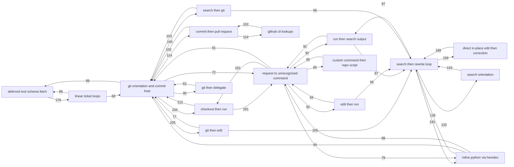

# Automation Candidates

A network of candidate workflows for internal MSP developer tooling, derived from observed
Claude Code session behavior. Generated by `comb/`; see
`docs/superpowers/specs/2026-09-14-comb-ontology-design.md`.

**This file is generated.** Edit `comb/ontology.json` through the CLI, never by hand:
`bun comb/ontology.mjs status N001 built`. `Status` is human-owned and survives every run.

**`Distinct projects` is a count, never engagement names.** Nodes seen in one project get a
mechanical description only.

_Last run: 2026-11-06 · corpus: 21208 steps / 359 sessions / 88 project dirs · 51 nodes · 295 flow edges · 0 motifs waiting_

## Themes

Labels the skill assigns per node with `annotate --theme`.

| Theme | Nodes | Friction share |
|---|---|---|
| git | 3 | 27% |
| unrecognized commands | 7 | 16% |
| delegation | 3 | 15% |
| (unlabeled) | 15 | 11% |
| linear | 1 | 9% |
| editing | 5 | 5% |
| correction | 5 | 4% |
| orientation | 3 | 3% |
| tool schemas | 2 | 3% |
| ad-hoc python | 1 | 3% |
| skills | 3 | 2% |
| mcp bulk | 3 | 0% |

## Candidates

| ID | Name | Theme | Motifs | Occurrences | Distinct projects | Median time | Correction | Class | Type | Status | Candidate tool |
|---|---|---|---|---|---|---|---|---|---|---|---|
| `N003` | git orientation and commit loop | git | 30 | 2150 | 55 | 30s | 19% | tool | hook | new | A session-start repo primer plus a scripted commit-and-verify path enforced by a hook. |
| `N002` | request to unrecognized command | unrecognized commands | 29 | 1550 | 57 | 37s | 21% | tool | script | new | Widen the vocabulary for the commands behind this node so they can be named, then split it into real candidates. |
| `N011` | subagent dispatch then correction | delegation | 23 | 1006 | 27 | 208s | 35% | tool | harness | new | Named subagent types with a tighter brief and return contract instead of ad-hoc general-purpose dispatch. |
| `N040` | `Mcp(other)` |  | 20 | 1619 | 20 | 7s | 10% | tool |  | new |  |
| `N004` | linear ticket loops | linear | 46 | 1563 | 45 | 6s | 12% | tool | mcp | new | A bulk ticket upsert with a preview-before-write step, paired with the Linear project-management skills. |
| `N015` | github cli lookups | git | 13 | 716 | 32 | 14s | 20% | tool | skill | new | A PR-context summarizer that runs at session start. |
| `N010` | direct in-place edit then correction | editing | 15 | 438 | 39 | 120s | 23% | unclassified | skill | new | The same guarded batch-edit primitive as the search-then-rewrite loop, with preview before apply. |
| `N006` | inline python via heredoc | ad-hoc python | 34 | 923 | 46 | 15s | 9% | tool | script | new | A checked data-inspection helper (query, shape, diff) that replaces ad-hoc heredoc Python with one call. |
| `N001` | deferred tool schema fetch | tool schemas | 27 | 851 | 55 | 8s | 5% | doc | harness | new | Preload the hot deferred tools per project in settings so the first action is the work itself. |
| `N012` | search orientation | orientation | 7 | 382 | 44 | 93s | 20% | unclassified | harness | new | Repo structure notes; shared with the filesystem-orientation node. |
| `N020` | custom command then repo script | unrecognized commands | 9 | 357 | 32 | 17s | 11% | tool | script | new | Name the repo script in INTERNAL_SCRIPTS, then fold both steps into one validate command. |
| `N030` | unrecognized tool then correction | correction | 5 | 287 | 21 | 83s | 39% | tool | harness | new | Add the tool to the vocabulary so this node can be named. |
| `N009` | checkout then run | unrecognized commands | 16 | 602 | 45 | 18s | 17% | unclassified | script | new | Blocked on naming the command; widen the vocabulary first. |
| `N019` | commit then pull request | git | 8 | 253 | 31 | 9s | 22% | unclassified | script | new | A commit-push-PR script that enforces the house branch and PR conventions. |
| `N037` | git then delegate | delegation | 5 | 161 | 21 | 31s | 32% | tool | harness | new | Same as the delegation node: a named subagent with a real brief. |
| `N021` | markdown draft then correction | correction | 3 | 100 | 26 | 236s | 24% | unclassified | skill | new | A document outline-and-approve step before the full write. |
| `N032` | screenshot review | skills | 2 | 84 | 15 | 0s | 18% | unclassified | harness | new | None; a measurement artifact until the projector distinguishes attachments. |
| `N036` | artifact publish then correction | correction | 2 | 31 | 9 | 283s | 26% | tool | skill | new | A preview-and-approve step before publishing an artifact. |
| `N042` | `Mcp(slack) → User` |  | 1 | 45 | 19 | 191s | 24% | unclassified |  | new |  |
| `N007` | search then rewrite loop | editing | 14 | 683 | 49 | 5s | 9% | tool | skill | new | A guarded batch-edit primitive: match, preview, apply, verify in one step. |
| `N035` | slack schema fetch and call | tool schemas | 9 | 389 | 23 | 3s | 11% | tool | harness | new | Preload the hot Slack tools per project. |
| `N038` | markdown edit streaks | editing | 3 | 169 | 19 | 2s | 12% | tool | skill | new | None on its own; pairs with the multi-file edit primitive. |
| `N024` | clarifying question round trip | correction | 2 | 46 | 25 | 35s | 26% | tool | harness | new | None; a sign that briefs need sharpening before work starts. |
| `N005` | skill invocation handoff | skills | 6 | 335 | 47 | 5s | 7% | doc | harness | rejected | None yet; treat as a measure of skill usage and revisit if the correction rate rises. |
| `N014` | edit then run | unrecognized commands | 8 | 181 | 36 | 14s | 7% | doc | script | rejected | A runbook once the command is named; the edit half belongs to the batch-edit primitive. |
| `N054` | `User → User → Bash(python3:stdin)` |  | 1 | 18 | 10 | 173s | 28% | tool |  | new |  |
| `N016` | run then search output | unrecognized commands | 6 | 202 | 37 | 9s | 9% | doc | script | rejected | A structured-output wrapper for the command once it is named. |
| `N028` | search then git | orientation | 5 | 208 | 28 | 7s | 16% | unclassified | harness | rejected | None on its own; covered by the orientation primer. |
| `N017` | git then edit | editing | 5 | 204 | 32 | 7s | 11% | unclassified | skill | rejected | None; fold into the batch-edit primitive's documentation. |
| `N029` | custom command then delegate | delegation | 3 | 51 | 15 | 25s | 45% | tool | harness | new | A named subagent with a real brief for the workflow behind this command. |
| `N052` | `Bash(git) → Write(.md)` |  | 1 | 25 | 13 | 44s | 16% | unclassified |  | new |  |
| `N023` | pull request then run | unrecognized commands | 3 | 101 | 26 | 11s | 23% | unclassified | script | rejected | Blocked on naming the command. |
| `N043` | `Bash(script) → Bash(git)` |  | 2 | 81 | 21 | 15s | 12% | unclassified |  | new |  |
| `N018` | fireflies transcript loops | mcp bulk | 4 | 178 | 20 | 4s | 4% | tool | mcp | new | A batch transcript fetch, or preloading the Fireflies tools so the loop is one call. |
| `N013` | box document loops | mcp bulk | 5 | 212 | 17 | 3s | 2% | tool | mcp | new | A batch Box list-and-fetch helper. |
| `N008` | filesystem orientation | orientation | 3 | 55 | 33 | 10s | 11% | unclassified | harness | new | Per-repo structure notes in CLAUDE.md or a shared repo-map primer at session start. |
| `N044` | `Bash(git) → Bash(python3:stdin)` |  | 1 | 43 | 15 | 12s | 2% | doc |  | new |  |
| `N050` | `Bash(script) → Bash(python3:stdin)` |  | 1 | 23 | 12 | 18s | 13% | unclassified |  | new |  |
| `N022` | locate then run | unrecognized commands | 4 | 48 | 26 | 8s | 17% | unclassified | script | rejected | Blocked on naming the command. |
| `N031` | harvest time entry loops | mcp bulk | 1 | 181 | 4 | 2s | 8% | tool | mcp | new | A batch time-entry operation or a CSV-to-Harvest loader. |
| `N048` | `Bash(other) → ToolSearch` |  | 1 | 28 | 11 | 12s | 18% | unclassified |  | new |  |
| `N041` | `ToolSearch → Tool(other)` |  | 1 | 47 | 20 | 6s | 36% | tool |  | new |  |
| `N049` | `Bash(gh) → Bash(grep)` |  | 1 | 20 | 15 | 14s | 5% | doc |  | new |  |
| `N045` | `User → ToolSearch → Mcp(other)` |  | 1 | 32 | 12 | 7s | 16% | unclassified |  | new |  |
| `N051` | `Bash(gh) → ToolSearch` |  | 1 | 24 | 15 | 7s | 0% | doc |  | new |  |
| `N046` | `User → Skill(brainstorming) → User` |  | 2 | 37 | 16 | 0s | 24% | unclassified |  | new |  |
| `N025` | artifact design skill load | skills | 1 | 0 | 0 | 0s | 0% | unclassified | harness | rejected | None; a measurement artifact of skill loading. |
| `N033` | python edit streaks | editing | 1 | 0 | 0 | 0s | 0% | unclassified | skill | new | A multi-file edit primitive, or accept as normal editing. |
| `N034` | run then ask | correction | 2 | 0 | 0 | 0s | 0% | unclassified | harness | rejected | Blocked on naming the command. |
| `N047` | `ToolSearch → WebFetch` |  | 1 | 0 | 0 | 0s | 0% | unclassified |  | new |  |
| `N053` | `Bash(script) → Bash(sed)` |  | 1 | 0 | 0 | 0s | 0% | unclassified |  | new |  |

## Build order

By `buildScore` = friction mass × (1 + betweenness). Friction mass is an estimate: overlapping motifs inside one session are counted more than once.

| # | Node | Build score | Cumulative friction |
|---|---|---|---|
| 1 | `N003` git orientation and commit loop | 476550376 | 20% |
| 2 | `N002` request to unrecognized command | 294740480 | 32% |
| 3 | `N011` subagent dispatch then correction | 189695095 | 45% |
| 4 | `N040` N040 | 149266556 | 55% |
| 5 | `N004` linear ticket loops | 137179332 | 65% |
| 6 | `N015` github cli lookups | 94467918 | 71% |
| 7 | `N010` direct in-place edit then correction | 57517729 | 75% |
| 8 | `N006` inline python via heredoc | 48436133 | 78% |
| 9 | `N001` deferred tool schema fetch | 43895074 | 81% |
| 10 | `N012` search orientation | 41427119 | 84% |

## Flow

Transitions between nodes inside a session. Shown when count ≥ 5 and sessions ≥ 3.

| From | To | Count | Sessions | Median gap |
|---|---|---|---|---|
| `N009` checkout then run | `N002` request to unrecognized command | 261 | 106 | 0s |
| `N002` request to unrecognized command | `N009` checkout then run | 251 | 100 | 0s |
| `N003` git orientation and commit loop | `N009` checkout then run | 234 | 83 | 0s |
| `N009` checkout then run | `N003` git orientation and commit loop | 212 | 84 | 0s |
| `N007` search then rewrite loop | `N006` inline python via heredoc | 191 | 72 | 0s |
| `N010` direct in-place edit then correction | `N007` search then rewrite loop | 189 | 84 | 0s |
| `N001` deferred tool schema fetch | `N004` linear ticket loops | 176 | 91 | 0s |
| `N007` search then rewrite loop | `N010` direct in-place edit then correction | 156 | 62 | 0s |
| `N003` git orientation and commit loop | `N028` search then git | 144 | 54 | 0s |
| `N012` search orientation | `N007` search then rewrite loop | 143 | 78 | 0s |
| `N007` search then rewrite loop | `N012` search orientation | 133 | 73 | 0s |
| `N006` inline python via heredoc | `N007` search then rewrite loop | 126 | 57 | 13s |
| `N003` git orientation and commit loop | `N019` commit then pull request | 114 | 57 | 0s |
| `N019` commit then pull request | `N015` github cli lookups | 114 | 64 | 0s |
| `N003` git orientation and commit loop | `N017` git then edit | 105 | 49 | 0s |
| `N017` git then edit | `N007` search then rewrite loop | 105 | 54 | 0s |
| `N028` search then git | `N003` git orientation and commit loop | 103 | 58 | 0s |
| `N015` github cli lookups | `N019` commit then pull request | 102 | 53 | 0s |
| `N019` commit then pull request | `N003` git orientation and commit loop | 102 | 61 | 0s |
| `N003` git orientation and commit loop | `N001` deferred tool schema fetch | 99 | 65 | 0s |
| `N006` inline python via heredoc | `N003` git orientation and commit loop | 94 | 46 | 25s |
| `N002` request to unrecognized command | `N016` run then search output | 92 | 53 | 0s |
| `N002` request to unrecognized command | `N014` edit then run | 92 | 51 | 0s |
| `N016` run then search output | `N002` request to unrecognized command | 92 | 55 | 0s |
| `N003` git orientation and commit loop | `N037` git then delegate | 90 | 28 | 0s |
| `N004` linear ticket loops | `N001` deferred tool schema fetch | 88 | 42 | 0s |
| `N006` inline python via heredoc | `N002` request to unrecognized command | 88 | 45 | 29s |
| `N007` search then rewrite loop | `N016` run then search output | 87 | 51 | 0s |
| `N016` run then search output | `N007` search then rewrite loop | 87 | 60 | 0s |
| `N002` request to unrecognized command | `N020` custom command then repo script | 85 | 31 | 0s |
| `N014` edit then run | `N002` request to unrecognized command | 84 | 50 | 0s |
| `N002` request to unrecognized command | `N003` git orientation and commit loop | 81 | 54 | 0s |
| `N020` custom command then repo script | `N002` request to unrecognized command | 80 | 38 | 18s |
| `N002` request to unrecognized command | `N006` inline python via heredoc | 79 | 54 | 1s |
| `N017` git then edit | `N003` git orientation and commit loop | 77 | 47 | 0s |
| `N003` git orientation and commit loop | `N002` request to unrecognized command | 72 | 51 | 38s |
| `N004` linear ticket loops | `N003` git orientation and commit loop | 68 | 50 | 19s |
| `N014` edit then run | `N007` search then rewrite loop | 66 | 51 | 0s |
| `N028` search then git | `N007` search then rewrite loop | 66 | 45 | 0s |
| `N037` git then delegate | `N003` git orientation and commit loop | 62 | 23 | 0s |
| `N007` search then rewrite loop | `N014` edit then run | 58 | 43 | 0s |
| `N001` deferred tool schema fetch | `N003` git orientation and commit loop | 55 | 50 | 1s |
| `N037` git then delegate | `N011` subagent dispatch then correction | 55 | 28 | 0s |
| `N003` git orientation and commit loop | `N004` linear ticket loops | 54 | 39 | 0s |
| `N007` search then rewrite loop | `N017` git then edit | 54 | 38 | 0s |
| `N011` subagent dispatch then correction | `N002` request to unrecognized command | 52 | 18 | 0s |
| `N015` github cli lookups | `N023` pull request then run | 52 | 42 | 0s |
| `N023` pull request then run | `N002` request to unrecognized command | 52 | 42 | 0s |
| `N002` request to unrecognized command | `N029` custom command then delegate | 51 | 21 | 0s |
| `N029` custom command then delegate | `N011` subagent dispatch then correction | 51 | 21 | 0s |
| `N002` request to unrecognized command | `N023` pull request then run | 49 | 36 | 0s |
| `N023` pull request then run | `N015` github cli lookups | 49 | 36 | 0s |
| `N007` search then rewrite loop | `N028` search then git | 48 | 36 | 0s |
| `N007` search then rewrite loop | `N020` custom command then repo script | 48 | 31 | 17s |
| `N001` deferred tool schema fetch | `N035` slack schema fetch and call | 46 | 40 | 0s |
| `N035` slack schema fetch and call | `N042` N042 | 45 | 34 | 6s |
| `N040` N040 | `N003` git orientation and commit loop | 45 | 26 | 56s |
| `N003` git orientation and commit loop | `N044` N044 | 43 | 27 | 0s |
| `N044` N044 | `N006` inline python via heredoc | 43 | 27 | 0s |
| `N004` linear ticket loops | `N015` github cli lookups | 42 | 34 | 10s |
| `N020` custom command then repo script | `N043` N043 | 42 | 26 | 0s |
| `N043` N043 | `N003` git orientation and commit loop | 42 | 26 | 0s |
| `N015` github cli lookups | `N004` linear ticket loops | 41 | 29 | 0s |
| `N003` git orientation and commit loop | `N043` N043 | 39 | 18 | 0s |
| `N043` N043 | `N020` custom command then repo script | 39 | 18 | 0s |
| `N002` request to unrecognized command | `N022` locate then run | 37 | 31 | 0s |
| `N006` inline python via heredoc | `N020` custom command then repo script | 37 | 27 | 47s |
| `N004` linear ticket loops | `N002` request to unrecognized command | 36 | 35 | 25s |
| `N007` search then rewrite loop | `N002` request to unrecognized command | 36 | 26 | 50s |
| `N004` linear ticket loops | `N007` search then rewrite loop | 35 | 28 | 16s |
| `N012` search orientation | `N010` direct in-place edit then correction | 35 | 27 | 0s |
| `N011` subagent dispatch then correction | `N003` git orientation and commit loop | 33 | 23 | 172s |
| `N001` deferred tool schema fetch | `N045` N045 | 32 | 24 | 0s |
| `N020` custom command then repo script | `N011` subagent dispatch then correction | 32 | 11 | 29s |
| `N045` N045 | `N040` N040 | 32 | 24 | 0s |
| `N030` unrecognized tool then correction | `N003` git orientation and commit loop | 31 | 12 | 39s |
| `N005` skill invocation handoff | `N001` deferred tool schema fetch | 30 | 17 | 0s |
| `N007` search then rewrite loop | `N004` linear ticket loops | 30 | 25 | 15s |
| `N040` N040 | `N007` search then rewrite loop | 30 | 16 | 23s |
| `N002` request to unrecognized command | `N011` subagent dispatch then correction | 29 | 14 | 0s |
| `N002` request to unrecognized command | `N048` N048 | 28 | 23 | 0s |
| `N007` search then rewrite loop | `N003` git orientation and commit loop | 28 | 22 | 103s |
| `N007` search then rewrite loop | `N040` N040 | 27 | 14 | 17s |
| `N011` subagent dispatch then correction | `N037` git then delegate | 27 | 16 | 0s |
| `N035` slack schema fetch and call | `N004` linear ticket loops | 27 | 20 | 3s |
| `N004` linear ticket loops | `N018` fireflies transcript loops | 26 | 18 | 10s |
| `N011` subagent dispatch then correction | `N030` unrecognized tool then correction | 26 | 12 | 86s |
| `N001` deferred tool schema fetch | `N031` harvest time entry loops | 25 | 16 | 3s |
| `N003` git orientation and commit loop | `N052` N052 | 25 | 18 | 0s |
| `N003` git orientation and commit loop | `N040` N040 | 25 | 14 | 15s |
| `N007` search then rewrite loop | `N015` github cli lookups | 25 | 22 | 8s |
| `N022` locate then run | `N002` request to unrecognized command | 25 | 24 | 0s |
| `N040` N040 | `N035` slack schema fetch and call | 25 | 19 | 4s |
| `N001` deferred tool schema fetch | `N030` unrecognized tool then correction | 24 | 19 | 0s |
| `N015` github cli lookups | `N051` N051 | 24 | 21 | 0s |
| `N020` custom command then repo script | `N007` search then rewrite loop | 24 | 17 | 12s |
| `N030` unrecognized tool then correction | `N011` subagent dispatch then correction | 24 | 9 | 29s |
| `N030` unrecognized tool then correction | `N041` N041 | 24 | 19 | 0s |
| `N002` request to unrecognized command | `N015` github cli lookups | 23 | 16 | 137s |
| `N004` linear ticket loops | `N035` slack schema fetch and call | 23 | 17 | 3s |
| `N011` subagent dispatch then correction | `N029` custom command then delegate | 23 | 12 | 0s |
| `N020` custom command then repo script | `N050` N050 | 23 | 16 | 0s |
| `N028` search then git | `N017` git then edit | 23 | 19 | 0s |
| `N029` custom command then delegate | `N002` request to unrecognized command | 23 | 12 | 0s |
| `N050` N050 | `N006` inline python via heredoc | 23 | 16 | 0s |
| `N002` request to unrecognized command | `N004` linear ticket loops | 22 | 21 | 0s |
| `N007` search then rewrite loop | `N038` markdown edit streaks | 22 | 16 | 27s |
| `N010` direct in-place edit then correction | `N003` git orientation and commit loop | 22 | 18 | 0s |
| `N012` search orientation | `N003` git orientation and commit loop | 22 | 18 | 0s |
| `N041` N041 | `N030` unrecognized tool then correction | 22 | 19 | 0s |
| `N002` request to unrecognized command | `N040` N040 | 21 | 12 | 17s |
| `N007` search then rewrite loop | `N033` python edit streaks | 21 | 7 | 17s |
| `N018` fireflies transcript loops | `N004` linear ticket loops | 21 | 15 | 0s |
| `N040` N040 | `N002` request to unrecognized command | 21 | 17 | 33s |
| `N003` git orientation and commit loop | `N030` unrecognized tool then correction | 20 | 10 | 70s |
| `N008` filesystem orientation | `N002` request to unrecognized command | 20 | 20 | 0s |
| `N015` github cli lookups | `N049` N049 | 20 | 18 | 0s |
| `N020` custom command then repo script | `N053` N053 | 20 | 15 | 0s |
| `N049` N049 | `N007` search then rewrite loop | 20 | 18 | 0s |
| `N053` N053 | `N007` search then rewrite loop | 20 | 15 | 0s |
| `N002` request to unrecognized command | `N001` deferred tool schema fetch | 19 | 18 | 187s |
| `N002` request to unrecognized command | `N007` search then rewrite loop | 19 | 12 | 41s |
| `N006` inline python via heredoc | `N015` github cli lookups | 19 | 11 | 47s |
| `N011` subagent dispatch then correction | `N020` custom command then repo script | 19 | 8 | 43s |
| `N035` slack schema fetch and call | `N040` N040 | 19 | 17 | 5s |
| `N015` github cli lookups | `N007` search then rewrite loop | 18 | 16 | 12s |
| `N033` python edit streaks | `N020` custom command then repo script | 18 | 5 | 14s |
| `N038` markdown edit streaks | `N003` git orientation and commit loop | 18 | 14 | 8s |
| `N040` N040 | `N001` deferred tool schema fetch | 18 | 10 | 701s |
| `N054` N054 | `N006` inline python via heredoc | 18 | 15 | 0s |
| `N003` git orientation and commit loop | `N007` search then rewrite loop | 17 | 14 | 40s |
| `N033` python edit streaks | `N007` search then rewrite loop | 17 | 6 | 14s |
| `N002` request to unrecognized command | `N034` run then ask | 16 | 13 | 0s |
| `N005` skill invocation handoff | `N002` request to unrecognized command | 16 | 16 | 0s |
| `N007` search then rewrite loop | `N011` subagent dispatch then correction | 16 | 14 | 33s |
| `N011` subagent dispatch then correction | `N004` linear ticket loops | 16 | 10 | 15s |
| `N018` fireflies transcript loops | `N007` search then rewrite loop | 16 | 12 | 23s |
| `N035` slack schema fetch and call | `N003` git orientation and commit loop | 16 | 13 | 12s |
| `N002` request to unrecognized command | `N030` unrecognized tool then correction | 15 | 9 | 129s |
| `N003` git orientation and commit loop | `N006` inline python via heredoc | 15 | 12 | 97s |
| `N011` subagent dispatch then correction | `N006` inline python via heredoc | 15 | 10 | 56s |
| `N001` deferred tool schema fetch | `N018` fireflies transcript loops | 14 | 13 | 0s |
| `N003` git orientation and commit loop | `N011` subagent dispatch then correction | 14 | 12 | 89s |
| `N003` git orientation and commit loop | `N012` search orientation | 14 | 14 | 241s |
| `N003` git orientation and commit loop | `N005` skill invocation handoff | 14 | 14 | 43s |
| `N005` skill invocation handoff | `N040` N040 | 14 | 13 | 0s |
| `N006` inline python via heredoc | `N040` N040 | 14 | 11 | 19s |
| `N015` github cli lookups | `N002` request to unrecognized command | 14 | 12 | 127s |
| `N020` custom command then repo script | `N003` git orientation and commit loop | 14 | 13 | 93s |
| `N030` unrecognized tool then correction | `N002` request to unrecognized command | 14 | 9 | 7s |
| `N034` run then ask | `N002` request to unrecognized command | 14 | 11 | 63s |
| `N001` deferred tool schema fetch | `N005` skill invocation handoff | 13 | 13 | 0s |
| `N001` deferred tool schema fetch | `N040` N040 | 13 | 13 | 2s |
| `N003` git orientation and commit loop | `N010` direct in-place edit then correction | 13 | 13 | 467s |
| `N004` linear ticket loops | `N006` inline python via heredoc | 13 | 9 | 23s |
| `N004` linear ticket loops | `N013` box document loops | 13 | 9 | 17s |
| `N005` skill invocation handoff | `N006` inline python via heredoc | 13 | 13 | 18s |
| `N008` filesystem orientation | `N007` search then rewrite loop | 13 | 13 | 10s |
| `N013` box document loops | `N035` slack schema fetch and call | 13 | 6 | 3s |
| `N040` N040 | `N011` subagent dispatch then correction | 13 | 10 | 73s |
| `N001` deferred tool schema fetch | `N047` N047 | 12 | 12 | 0s |
| `N003` git orientation and commit loop | `N015` github cli lookups | 12 | 11 | 338s |
| `N006` inline python via heredoc | `N036` artifact publish then correction | 12 | 8 | 28s |
| `N011` subagent dispatch then correction | `N012` search orientation | 12 | 7 | 160s |
| `N011` subagent dispatch then correction | `N001` deferred tool schema fetch | 12 | 11 | 190s |
| `N015` github cli lookups | `N003` git orientation and commit loop | 12 | 10 | 35s |
| `N018` fireflies transcript loops | `N006` inline python via heredoc | 12 | 10 | 30s |
| `N020` custom command then repo script | `N033` python edit streaks | 12 | 4 | 56s |
| `N040` N040 | `N006` inline python via heredoc | 12 | 7 | 11s |
| `N001` deferred tool schema fetch | `N015` github cli lookups | 11 | 11 | 2s |
| `N001` deferred tool schema fetch | `N013` box document loops | 11 | 9 | 0s |
| `N002` request to unrecognized command | `N012` search orientation | 11 | 10 | 115s |
| `N003` git orientation and commit loop | `N020` custom command then repo script | 11 | 11 | 45s |
| `N007` search then rewrite loop | `N013` box document loops | 11 | 8 | 10s |
| `N010` direct in-place edit then correction | `N002` request to unrecognized command | 11 | 11 | 0s |
| `N013` box document loops | `N007` search then rewrite loop | 11 | 8 | 18s |
| `N015` github cli lookups | `N006` inline python via heredoc | 11 | 9 | 38s |
| `N030` unrecognized tool then correction | `N015` github cli lookups | 11 | 7 | 0s |
| `N031` harvest time entry loops | `N001` deferred tool schema fetch | 11 | 8 | 85s |
| `N035` slack schema fetch and call | `N007` search then rewrite loop | 11 | 11 | 11s |
| `N036` artifact publish then correction | `N040` N040 | 11 | 9 | 8s |
| `N002` request to unrecognized command | `N038` markdown edit streaks | 10 | 8 | 27s |
| `N003` git orientation and commit loop | `N035` slack schema fetch and call | 10 | 9 | 9s |
| `N004` linear ticket loops | `N005` skill invocation handoff | 10 | 10 | 115s |
| `N005` skill invocation handoff | `N008` filesystem orientation | 10 | 9 | 0s |
| `N006` inline python via heredoc | `N011` subagent dispatch then correction | 10 | 9 | 92s |
| `N006` inline python via heredoc | `N001` deferred tool schema fetch | 10 | 9 | 153s |
| `N010` direct in-place edit then correction | `N012` search orientation | 10 | 7 | 0s |
| `N010` direct in-place edit then correction | `N015` github cli lookups | 10 | 8 | 0s |
| `N011` subagent dispatch then correction | `N010` direct in-place edit then correction | 10 | 9 | 332s |
| `N011` subagent dispatch then correction | `N007` search then rewrite loop | 10 | 7 | 12s |
| `N011` subagent dispatch then correction | `N040` N040 | 10 | 5 | 219s |
| `N012` search orientation | `N001` deferred tool schema fetch | 10 | 9 | 0s |
| `N013` box document loops | `N003` git orientation and commit loop | 10 | 7 | 40s |
| `N021` markdown draft then correction | `N011` subagent dispatch then correction | 10 | 8 | 8s |
| `N031` harvest time entry loops | `N040` N040 | 10 | 9 | 2s |
| `N038` markdown edit streaks | `N007` search then rewrite loop | 10 | 10 | 22s |
| `N038` markdown edit streaks | `N020` custom command then repo script | 10 | 7 | 15s |
| `N002` request to unrecognized command | `N035` slack schema fetch and call | 9 | 9 | 9s |
| `N006` inline python via heredoc | `N012` search orientation | 9 | 8 | 103s |
| `N007` search then rewrite loop | `N035` slack schema fetch and call | 9 | 8 | 12s |
| `N007` search then rewrite loop | `N018` fireflies transcript loops | 9 | 8 | 11s |
| `N007` search then rewrite loop | `N021` markdown draft then correction | 9 | 8 | 43s |
| `N011` subagent dispatch then correction | `N015` github cli lookups | 9 | 8 | 26s |
| `N012` search orientation | `N002` request to unrecognized command | 9 | 9 | 0s |
| `N015` github cli lookups | `N020` custom command then repo script | 9 | 6 | 122s |
| `N015` github cli lookups | `N012` search orientation | 9 | 8 | 249s |
| `N018` fireflies transcript loops | `N002` request to unrecognized command | 9 | 8 | 30s |
| `N018` fireflies transcript loops | `N035` slack schema fetch and call | 9 | 8 | 7s |
| `N021` markdown draft then correction | `N003` git orientation and commit loop | 9 | 9 | 11s |
| `N031` harvest time entry loops | `N002` request to unrecognized command | 9 | 9 | 12s |
| `N035` slack schema fetch and call | `N013` box document loops | 9 | 5 | 9s |
| `N035` slack schema fetch and call | `N002` request to unrecognized command | 9 | 8 | 13s |
| `N035` slack schema fetch and call | `N018` fireflies transcript loops | 9 | 8 | 1s |
| `N035` slack schema fetch and call | `N015` github cli lookups | 9 | 8 | 6s |
| `N051` N051 | `N004` linear ticket loops | 9 | 9 | 0s |
| `N001` deferred tool schema fetch | `N002` request to unrecognized command | 8 | 8 | 5s |
| `N001` deferred tool schema fetch | `N007` search then rewrite loop | 8 | 7 | 3s |
| `N002` request to unrecognized command | `N031` harvest time entry loops | 8 | 7 | 14s |
| `N002` request to unrecognized command | `N005` skill invocation handoff | 8 | 7 | 103s |
| `N002` request to unrecognized command | `N032` screenshot review | 8 | 7 | 51s |
| `N003` git orientation and commit loop | `N013` box document loops | 8 | 5 | 8s |
| `N003` git orientation and commit loop | `N038` markdown edit streaks | 8 | 7 | 21s |
| `N004` linear ticket loops | `N040` N040 | 8 | 8 | 4s |
| `N005` skill invocation handoff | `N003` git orientation and commit loop | 8 | 8 | 0s |
| `N006` inline python via heredoc | `N033` python edit streaks | 8 | 5 | 24s |
| `N006` inline python via heredoc | `N004` linear ticket loops | 8 | 8 | 25s |
| `N006` inline python via heredoc | `N032` screenshot review | 8 | 4 | 22s |
| `N013` box document loops | `N002` request to unrecognized command | 8 | 7 | 43s |
| `N015` github cli lookups | `N040` N040 | 8 | 7 | 14s |
| `N015` github cli lookups | `N011` subagent dispatch then correction | 8 | 6 | 36s |
| `N033` python edit streaks | `N006` inline python via heredoc | 8 | 6 | 21s |
| `N036` artifact publish then correction | `N002` request to unrecognized command | 8 | 6 | 0s |
| `N040` N040 | `N004` linear ticket loops | 8 | 8 | 2s |
| `N040` N040 | `N015` github cli lookups | 8 | 7 | 35s |
| `N040` N040 | `N036` artifact publish then correction | 8 | 5 | 225s |
| `N002` request to unrecognized command | `N021` markdown draft then correction | 7 | 7 | 52s |
| `N003` git orientation and commit loop | `N036` artifact publish then correction | 7 | 5 | 75s |
| `N004` linear ticket loops | `N031` harvest time entry loops | 7 | 6 | 12s |
| `N004` linear ticket loops | `N020` custom command then repo script | 7 | 7 | 117s |
| `N006` inline python via heredoc | `N021` markdown draft then correction | 7 | 7 | 43s |
| `N006` inline python via heredoc | `N018` fireflies transcript loops | 7 | 5 | 19s |
| `N006` inline python via heredoc | `N038` markdown edit streaks | 7 | 6 | 14s |
| `N007` search then rewrite loop | `N030` unrecognized tool then correction | 7 | 7 | 22s |
| `N010` direct in-place edit then correction | `N001` deferred tool schema fetch | 7 | 7 | 0s |
| `N013` box document loops | `N004` linear ticket loops | 7 | 6 | 29s |
| `N015` github cli lookups | `N030` unrecognized tool then correction | 7 | 7 | 37s |
| `N015` github cli lookups | `N035` slack schema fetch and call | 7 | 6 | 7s |
| `N018` fireflies transcript loops | `N003` git orientation and commit loop | 7 | 6 | 30s |
| `N020` custom command then repo script | `N006` inline python via heredoc | 7 | 6 | 45s |
| `N036` artifact publish then correction | `N003` git orientation and commit loop | 7 | 6 | 0s |
| `N038` markdown edit streaks | `N002` request to unrecognized command | 7 | 4 | 10s |
| `N040` N040 | `N031` harvest time entry loops | 7 | 7 | 1s |
| `N040` N040 | `N018` fireflies transcript loops | 7 | 7 | 1s |
| `N042` N042 | `N001` deferred tool schema fetch | 7 | 7 | 0s |
| `N042` N042 | `N003` git orientation and commit loop | 7 | 7 | 0s |
| `N002` request to unrecognized command | `N010` direct in-place edit then correction | 6 | 6 | 87s |
| `N006` inline python via heredoc | `N005` skill invocation handoff | 6 | 6 | 183s |
| `N007` search then rewrite loop | `N025` artifact design skill load | 6 | 6 | 19s |
| `N012` search orientation | `N011` subagent dispatch then correction | 6 | 6 | 0s |
| `N012` search orientation | `N015` github cli lookups | 6 | 6 | 0s |
| `N013` box document loops | `N040` N040 | 6 | 5 | 17s |
| `N015` github cli lookups | `N013` box document loops | 6 | 5 | 44s |
| `N015` github cli lookups | `N001` deferred tool schema fetch | 6 | 6 | 331s |
| `N020` custom command then repo script | `N012` search orientation | 6 | 3 | 71s |
| `N025` artifact design skill load | `N007` search then rewrite loop | 6 | 6 | 41s |
| `N031` harvest time entry loops | `N004` linear ticket loops | 6 | 6 | 21s |
| `N038` markdown edit streaks | `N006` inline python via heredoc | 6 | 5 | 43s |
| `N041` N041 | `N003` git orientation and commit loop | 6 | 6 | 57s |
| `N041` N041 | `N002` request to unrecognized command | 6 | 6 | 10s |
| `N001` deferred tool schema fetch | `N041` N041 | 5 | 5 | 0s |
| `N003` git orientation and commit loop | `N008` filesystem orientation | 5 | 5 | 32s |
| `N004` linear ticket loops | `N030` unrecognized tool then correction | 5 | 4 | 80s |
| `N004` linear ticket loops | `N021` markdown draft then correction | 5 | 5 | 45s |
| `N004` linear ticket loops | `N012` search orientation | 5 | 5 | 240s |
| `N005` skill invocation handoff | `N010` direct in-place edit then correction | 5 | 5 | 0s |
| `N011` subagent dispatch then correction | `N021` markdown draft then correction | 5 | 4 | 111s |
| `N015` github cli lookups | `N031` harvest time entry loops | 5 | 5 | 7s |
| `N015` github cli lookups | `N010` direct in-place edit then correction | 5 | 4 | 790s |
| `N020` custom command then repo script | `N038` markdown edit streaks | 5 | 5 | 39s |
| `N020` custom command then repo script | `N010` direct in-place edit then correction | 5 | 4 | 187s |
| `N020` custom command then repo script | `N015` github cli lookups | 5 | 4 | 8s |
| `N030` unrecognized tool then correction | `N012` search orientation | 5 | 5 | 12s |
| `N030` unrecognized tool then correction | `N010` direct in-place edit then correction | 5 | 5 | 0s |
| `N031` harvest time entry loops | `N035` slack schema fetch and call | 5 | 5 | 1s |
| `N032` screenshot review | `N006` inline python via heredoc | 5 | 3 | 0s |
| `N032` screenshot review | `N036` artifact publish then correction | 5 | 4 | 7s |
| `N035` slack schema fetch and call | `N006` inline python via heredoc | 5 | 5 | 11s |
| `N038` markdown edit streaks | `N033` python edit streaks | 5 | 3 | 16s |
| `N042` N042 | `N012` search orientation | 5 | 5 | 0s |
| `N046` N046 | `N024` clarifying question round trip | 5 | 5 | 0s |
| `N047` N047 | `N040` N040 | 5 | 5 | 61s |
| `N048` N048 | `N004` linear ticket loops | 5 | 5 | 0s |
| `N048` N048 | `N041` N041 | 5 | 5 | 0s |
| `N052` N052 | `N003` git orientation and commit loop | 5 | 5 | 6s |

## Network

The top 40 flow edges by count. The full list is in "Flow".

```mermaid
graph LR
  N001["deferred tool schema fetch"]
  N002["request to unrecognized command"]
  N003["git orientation and commit loop"]
  N004["linear ticket loops"]
  N006["inline python via heredoc"]
  N007["search then rewrite loop"]
  N009["checkout then run"]
  N010["direct in-place edit then correction"]
  N012["search orientation"]
  N014["edit then run"]
  N015["github cli lookups"]
  N016["run then search output"]
  N017["git then edit"]
  N019["commit then pull request"]
  N020["custom command then repo script"]
  N028["search then git"]
  N037["git then delegate"]
  N009 -->|261| N002
  N002 -->|251| N009
  N003 -->|234| N009
  N009 -->|212| N003
  N007 -->|191| N006
  N010 -->|189| N007
  N001 -->|176| N004
  N007 -->|156| N010
  N003 -->|144| N028
  N012 -->|143| N007
  N007 -->|133| N012
  N006 -->|126| N007
  N003 -->|114| N019
  N019 -->|114| N015
  N003 -->|105| N017
  N017 -->|105| N007
  N028 -->|103| N003
  N015 -->|102| N019
  N019 -->|102| N003
  N003 -->|99| N001
  N006 -->|94| N003
  N002 -->|92| N016
  N002 -->|92| N014
  N016 -->|92| N002
  N003 -->|90| N037
  N004 -->|88| N001
  N006 -->|88| N002
  N007 -->|87| N016
  N016 -->|87| N007
  N002 -->|85| N020
  N014 -->|84| N002
  N002 -->|81| N003
  N020 -->|80| N002
  N002 -->|79| N006
  N017 -->|77| N003
  N003 -->|72| N002
  N004 -->|68| N003
  N014 -->|66| N007
  N028 -->|66| N007
  N037 -->|62| N003
```

## Similarity

Node pairs with weighted Jaccard ≥ 0.3.

| A | B | Weight |
|---|---|---|
| `N040` N040 | `N045` N045 | 1 |
| `N030` unrecognized tool then correction | `N041` N041 | 0.8 |
| `N005` skill invocation handoff | `N008` filesystem orientation | 0.6 |
| `N010` direct in-place edit then correction | `N012` search orientation | 0.6 |
| `N011` subagent dispatch then correction | `N029` custom command then delegate | 0.6 |
| `N011` subagent dispatch then correction | `N037` git then delegate | 0.6 |
| `N012` search orientation | `N028` search then git | 0.6 |
| `N015` github cli lookups | `N019` commit then pull request | 0.6 |
| `N035` slack schema fetch and call | `N042` N042 | 0.6 |
| `N003` git orientation and commit loop | `N017` git then edit | 0.571 |
| `N007` search then rewrite loop | `N010` direct in-place edit then correction | 0.571 |
| `N010` direct in-place edit then correction | `N017` git then edit | 0.571 |
| `N017` git then edit | `N028` search then git | 0.571 |
| `N007` search then rewrite loop | `N017` git then edit | 0.5 |
| `N020` custom command then repo script | `N050` N050 | 0.444 |
| `N003` git orientation and commit loop | `N009` checkout then run | 0.429 |
| `N003` git orientation and commit loop | `N010` direct in-place edit then correction | 0.429 |
| `N003` git orientation and commit loop | `N019` commit then pull request | 0.429 |
| `N003` git orientation and commit loop | `N028` search then git | 0.429 |
| `N003` git orientation and commit loop | `N037` git then delegate | 0.429 |
| `N009` checkout then run | `N019` commit then pull request | 0.429 |
| `N009` checkout then run | `N028` search then git | 0.429 |
| `N009` checkout then run | `N029` custom command then delegate | 0.429 |
| `N009` checkout then run | `N037` git then delegate | 0.429 |
| `N010` direct in-place edit then correction | `N028` search then git | 0.429 |
| `N013` box document loops | `N030` unrecognized tool then correction | 0.429 |
| `N013` box document loops | `N035` slack schema fetch and call | 0.429 |
| `N013` box document loops | `N040` N040 | 0.429 |
| `N013` box document loops | `N045` N045 | 0.429 |
| `N019` commit then pull request | `N028` search then git | 0.429 |
| `N019` commit then pull request | `N037` git then delegate | 0.429 |
| `N028` search then git | `N037` git then delegate | 0.429 |
| `N029` custom command then delegate | `N037` git then delegate | 0.429 |
| `N030` unrecognized tool then correction | `N035` slack schema fetch and call | 0.429 |
| `N030` unrecognized tool then correction | `N040` N040 | 0.429 |
| `N030` unrecognized tool then correction | `N045` N045 | 0.429 |
| `N035` slack schema fetch and call | `N040` N040 | 0.429 |
| `N035` slack schema fetch and call | `N045` N045 | 0.429 |
| `N001` deferred tool schema fetch | `N004` linear ticket loops | 0.412 |
| `N008` filesystem orientation | `N022` locate then run | 0.4 |
| `N012` search orientation | `N016` run then search output | 0.4 |
| `N012` search orientation | `N049` N049 | 0.4 |
| `N015` github cli lookups | `N023` pull request then run | 0.4 |
| `N015` github cli lookups | `N049` N049 | 0.4 |
| `N015` github cli lookups | `N051` N051 | 0.4 |
| `N021` markdown draft then correction | `N052` N052 | 0.4 |
| `N024` clarifying question round trip | `N034` run then ask | 0.4 |
| `N044` N044 | `N054` N054 | 0.4 |
| `N050` N050 | `N054` N054 | 0.4 |
| `N002` request to unrecognized command | `N009` checkout then run | 0.385 |
| `N002` request to unrecognized command | `N028` search then git | 0.385 |
| `N002` request to unrecognized command | `N029` custom command then delegate | 0.385 |
| `N002` request to unrecognized command | `N037` git then delegate | 0.385 |
| `N004` linear ticket loops | `N009` checkout then run | 0.385 |
| `N004` linear ticket loops | `N019` commit then pull request | 0.385 |
| `N014` edit then run | `N016` run then search output | 0.333 |
| `N014` edit then run | `N022` locate then run | 0.333 |
| `N014` edit then run | `N023` pull request then run | 0.333 |
| `N014` edit then run | `N034` run then ask | 0.333 |
| `N014` edit then run | `N048` N048 | 0.333 |
| `N014` edit then run | `N053` N053 | 0.333 |
| `N016` run then search output | `N022` locate then run | 0.333 |
| `N016` run then search output | `N023` pull request then run | 0.333 |
| `N016` run then search output | `N034` run then ask | 0.333 |
| `N016` run then search output | `N048` N048 | 0.333 |
| `N016` run then search output | `N049` N049 | 0.333 |
| `N018` fireflies transcript loops | `N041` N041 | 0.333 |
| `N018` fireflies transcript loops | `N047` N047 | 0.333 |
| `N018` fireflies transcript loops | `N048` N048 | 0.333 |
| `N018` fireflies transcript loops | `N051` N051 | 0.333 |
| `N020` custom command then repo script | `N054` N054 | 0.333 |
| `N022` locate then run | `N023` pull request then run | 0.333 |
| `N022` locate then run | `N034` run then ask | 0.333 |
| `N022` locate then run | `N048` N048 | 0.333 |
| `N023` pull request then run | `N034` run then ask | 0.333 |
| `N023` pull request then run | `N048` N048 | 0.333 |
| `N023` pull request then run | `N049` N049 | 0.333 |
| `N023` pull request then run | `N051` N051 | 0.333 |
| `N034` run then ask | `N048` N048 | 0.333 |
| `N041` N041 | `N047` N047 | 0.333 |
| `N041` N041 | `N048` N048 | 0.333 |
| `N041` N041 | `N051` N051 | 0.333 |
| `N043` N043 | `N044` N044 | 0.333 |
| `N043` N043 | `N050` N050 | 0.333 |
| `N043` N043 | `N052` N052 | 0.333 |
| `N043` N043 | `N053` N053 | 0.333 |
| `N044` N044 | `N050` N050 | 0.333 |
| `N044` N044 | `N052` N052 | 0.333 |
| `N047` N047 | `N048` N048 | 0.333 |
| `N047` N047 | `N051` N051 | 0.333 |
| `N048` N048 | `N051` N051 | 0.333 |
| `N049` N049 | `N051` N051 | 0.333 |
| `N050` N050 | `N053` N053 | 0.333 |
| `N002` request to unrecognized command | `N016` run then search output | 0.308 |
| `N002` request to unrecognized command | `N022` locate then run | 0.308 |
| `N004` linear ticket loops | `N018` fireflies transcript loops | 0.308 |
| `N004` linear ticket loops | `N023` pull request then run | 0.308 |
| `N004` linear ticket loops | `N048` N048 | 0.308 |
| `N004` linear ticket loops | `N051` N051 | 0.308 |
| `N006` inline python via heredoc | `N020` custom command then repo script | 0.304 |

## Merge proposals

Pairs at or above 0.7. Accept: `bun comb/ontology.mjs merge <keep> <drop>`. Dismiss: `merge --dismiss <a> <b>`.

| A | B | Weight |
|---|---|---|
| `N040` N040 | `N045` N045 | 1 |
| `N030` unrecognized tool then correction | `N041` N041 | 0.8 |

## Review

Proposals from the independent reviewer, run 2026-09-14. Its brief is to prune candidates not worth building. Accept: `bun comb/review.mjs accept R001`. Dismiss: `bun comb/review.mjs dismiss R001`.

| ID | Kind | Node | Detail | Reason |
|---|---|---|---|---|
| `R008` | prune | `N009` checkout then run | status → rejected | correctionRate 0.195, retryDepth 1, betweenness 0, frictionShare 0.0065; tool is blocked on naming, and the loop is covered by N002 (betweenness 1) and N003 (betweenness 0.425) with 74 and 63 flow edges each. |

## Since last run

Window 2026-11-05 → 2026-11-06, 12 new sessions.

| Signal | Node | Detail |
|---|---|---|
| re-open | `N016` run then search output | rate change 83% |
| re-open | `N028` search then git | rate change 225% |

