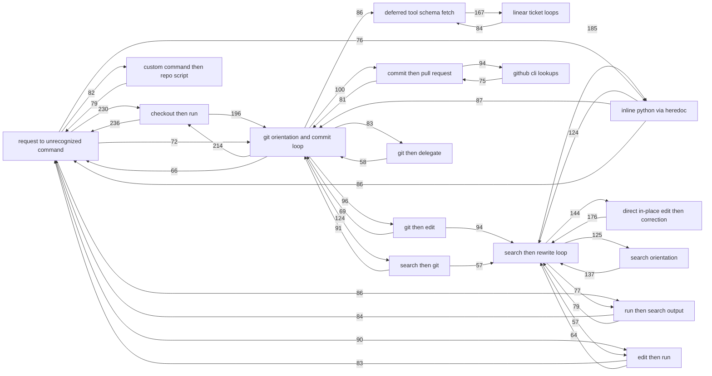

# Automation Candidates

A network of candidate workflows for internal MSP developer tooling, derived from observed
Claude Code session behavior. Generated by `comb/`; see
`docs/superpowers/specs/2026-09-14-comb-ontology-design.md`.

**This file is generated.** Edit `comb/ontology.json` through the CLI, never by hand:
`bun comb/ontology.mjs status N001 built`. `Status` is human-owned and survives every run.

**`Distinct projects` is a count, never engagement names.** Nodes seen in one project get a
mechanical description only.

_Last run: 2026-11-04 · corpus: 19526 steps / 336 sessions / 87 project dirs · 50 nodes · 283 flow edges · 0 motifs waiting_

## Themes

Labels the skill assigns per node with `annotate --theme`.

| Theme | Nodes | Friction share |
|---|---|---|
| git | 3 | 28% |
| unrecognized commands | 7 | 17% |
| delegation | 3 | 15% |
| (unlabeled) | 14 | 9% |
| linear | 1 | 8% |
| editing | 5 | 6% |
| correction | 5 | 4% |
| orientation | 3 | 4% |
| tool schemas | 2 | 3% |
| ad-hoc python | 1 | 3% |
| skills | 3 | 2% |
| mcp bulk | 3 | 0% |

## Candidates

| ID | Name | Theme | Motifs | Occurrences | Distinct projects | Median time | Correction | Class | Type | Status | Candidate tool |
|---|---|---|---|---|---|---|---|---|---|---|---|
| `N003` | git orientation and commit loop | git | 28 | 1843 | 54 | 23s | 19% | tool | hook | new | A session-start repo primer plus a scripted commit-and-verify path enforced by a hook. |
| `N002` | request to unrecognized command | unrecognized commands | 29 | 1504 | 56 | 37s | 21% | tool | script | new | Widen the vocabulary for the commands behind this node so they can be named, then split it into real candidates. |
| `N011` | subagent dispatch then correction | delegation | 23 | 946 | 26 | 172s | 35% | tool | harness | new | Named subagent types with a tighter brief and return contract instead of ad-hoc general-purpose dispatch. |
| `N040` | `Mcp(other)` |  | 19 | 1363 | 18 | 7s | 9% | tool |  | new |  |
| `N004` | linear ticket loops | linear | 46 | 1341 | 44 | 7s | 13% | tool | mcp | new | A bulk ticket upsert with a preview-before-write step, paired with the Linear project-management skills. |
| `N015` | github cli lookups | git | 12 | 610 | 30 | 14s | 21% | tool | skill | new | A PR-context summarizer that runs at session start. |
| `N010` | direct in-place edit then correction | editing | 15 | 419 | 38 | 120s | 23% | unclassified | skill | new | The same guarded batch-edit primitive as the search-then-rewrite loop, with preview before apply. |
| `N012` | search orientation | orientation | 7 | 364 | 43 | 101s | 20% | unclassified | harness | new | Repo structure notes; shared with the filesystem-orientation node. |
| `N001` | deferred tool schema fetch | tool schemas | 27 | 793 | 54 | 10s | 5% | doc | harness | new | Preload the hot deferred tools per project in settings so the first action is the work itself. |
| `N006` | inline python via heredoc | ad-hoc python | 34 | 890 | 45 | 14s | 8% | tool | script | new | A checked data-inspection helper (query, shape, diff) that replaces ad-hoc heredoc Python with one call. |
| `N009` | checkout then run | unrecognized commands | 16 | 563 | 46 | 18s | 17% | unclassified | script | new | Blocked on naming the command; widen the vocabulary first. |
| `N020` | custom command then repo script | unrecognized commands | 9 | 327 | 29 | 17s | 11% | tool | script | new | Name the repo script in INTERNAL_SCRIPTS, then fold both steps into one validate command. |
| `N030` | unrecognized tool then correction | correction | 5 | 234 | 20 | 84s | 39% | tool | harness | new | Add the tool to the vocabulary so this node can be named. |
| `N019` | commit then pull request | git | 8 | 193 | 29 | 10s | 23% | unclassified | script | new | A commit-push-PR script that enforces the house branch and PR conventions. |
| `N037` | git then delegate | delegation | 5 | 148 | 19 | 32s | 32% | tool | harness | new | Same as the delegation node: a named subagent with a real brief. |
| `N021` | markdown draft then correction | correction | 3 | 96 | 24 | 220s | 25% | tool | skill | new | A document outline-and-approve step before the full write. |
| `N032` | screenshot review | skills | 2 | 76 | 14 | 0s | 17% | unclassified | harness | new | None; a measurement artifact until the projector distinguishes attachments. |
| `N036` | artifact publish then correction | correction | 2 | 31 | 9 | 283s | 26% | tool | skill | new | A preview-and-approve step before publishing an artifact. |
| `N007` | search then rewrite loop | editing | 14 | 644 | 47 | 6s | 9% | tool | skill | new | A guarded batch-edit primitive: match, preview, apply, verify in one step. |
| `N042` | `Mcp(slack) → User` |  | 1 | 41 | 19 | 179s | 22% | unclassified |  | new |  |
| `N038` | markdown edit streaks | editing | 3 | 138 | 17 | 2s | 8% | tool | skill | new | None on its own; pairs with the multi-file edit primitive. |
| `N035` | slack schema fetch and call | tool schemas | 9 | 366 | 23 | 3s | 11% | tool | harness | new | Preload the hot Slack tools per project. |
| `N029` | custom command then delegate | delegation | 3 | 96 | 14 | 25s | 38% | tool | harness | new | A named subagent with a real brief for the workflow behind this command. |
| `N024` | clarifying question round trip | correction | 2 | 46 | 25 | 35s | 26% | tool | harness | new | None; a sign that briefs need sharpening before work starts. |
| `N005` | skill invocation handoff | skills | 6 | 308 | 45 | 6s | 7% | doc | harness | rejected | None yet; treat as a measure of skill usage and revisit if the correction rate rises. |
| `N014` | edit then run | unrecognized commands | 8 | 178 | 35 | 15s | 6% | doc | script | rejected | A runbook once the command is named; the edit half belongs to the batch-edit primitive. |
| `N016` | run then search output | unrecognized commands | 6 | 185 | 35 | 11s | 10% | doc | script | rejected | A structured-output wrapper for the command once it is named. |
| `N017` | git then edit | editing | 5 | 184 | 31 | 7s | 8% | doc | skill | rejected | None; fold into the batch-edit primitive's documentation. |
| `N028` | search then git | orientation | 5 | 168 | 26 | 7s | 18% | unclassified | harness | rejected | None on its own; covered by the orientation primer. |
| `N023` | pull request then run | unrecognized commands | 3 | 91 | 25 | 11s | 24% | unclassified | script | rejected | Blocked on naming the command. |
| `N043` | `Bash(script) → Bash(git)` |  | 2 | 70 | 19 | 15s | 13% | unclassified |  | new |  |
| `N018` | fireflies transcript loops | mcp bulk | 4 | 178 | 20 | 4s | 4% | tool | mcp | new | A batch transcript fetch, or preloading the Fireflies tools so the loop is one call. |
| `N013` | box document loops | mcp bulk | 5 | 224 | 17 | 3s | 2% | tool | mcp | new | A batch Box list-and-fetch helper. |
| `N008` | filesystem orientation | orientation | 3 | 55 | 33 | 10s | 11% | unclassified | harness | new | Per-repo structure notes in CLAUDE.md or a shared repo-map primer at session start. |
| `N033` | python edit streaks | editing | 1 | 126 | 4 | 4s | 1% | tool | skill | new | A multi-file edit primitive, or accept as normal editing. |
| `N044` | `Bash(git) → Bash(python3:stdin)` |  | 1 | 38 | 13 | 13s | 3% | doc |  | new |  |
| `N050` | `Bash(script) → Bash(python3:stdin)` |  | 1 | 22 | 11 | 19s | 14% | unclassified |  | new |  |
| `N022` | locate then run | unrecognized commands | 4 | 48 | 26 | 8s | 17% | unclassified | script | rejected | Blocked on naming the command. |
| `N031` | harvest time entry loops | mcp bulk | 1 | 170 | 4 | 2s | 9% | tool | mcp | new | A batch time-entry operation or a CSV-to-Harvest loader. |
| `N048` | `Bash(other) → ToolSearch` |  | 1 | 26 | 11 | 12s | 19% | unclassified |  | new |  |
| `N053` | `Bash(script) → Bash(sed)` |  | 1 | 20 | 13 | 11s | 5% | doc |  | new |  |
| `N041` | `ToolSearch → Tool(other)` |  | 1 | 43 | 19 | 5s | 37% | tool |  | new |  |
| `N045` | `User → ToolSearch → Mcp(other)` |  | 1 | 29 | 11 | 7s | 17% | unclassified |  | new |  |
| `N051` | `Bash(gh) → ToolSearch` |  | 1 | 20 | 14 | 9s | 0% | doc |  | new |  |
| `N046` | `User → Skill(brainstorming) → User` |  | 2 | 36 | 15 | 0s | 25% | tool |  | new |  |
| `N047` | `ToolSearch → WebFetch` |  | 1 | 22 | 11 | 4s | 9% | doc |  | new |  |
| `N025` | artifact design skill load | skills | 1 | 18 | 14 | 0s | 0% | unclassified | harness | rejected | None; a measurement artifact of skill loading. |
| `N034` | run then ask | correction | 2 | 0 | 0 | 0s | 0% | unclassified | harness | rejected | Blocked on naming the command. |
| `N049` | `Bash(gh) → Bash(grep)` |  | 1 | 0 | 0 | 0s | 0% | unclassified |  | new |  |
| `N052` | `Bash(git) → Write(.md)` |  | 1 | 0 | 0 | 0s | 0% | unclassified |  | new |  |

## Build order

By `buildScore` = friction mass × (1 + betweenness). Friction mass is an estimate: overlapping motifs inside one session are counted more than once.

| # | Node | Build score | Cumulative friction |
|---|---|---|---|
| 1 | `N003` git orientation and commit loop | 422901131 | 20% |
| 2 | `N002` request to unrecognized command | 287367688 | 33% |
| 3 | `N011` subagent dispatch then correction | 164520970 | 46% |
| 4 | `N040` N040 | 112575724 | 55% |
| 5 | `N004` linear ticket loops | 102932001 | 63% |
| 6 | `N015` github cli lookups | 85465563 | 69% |
| 7 | `N010` direct in-place edit then correction | 51670249 | 74% |
| 8 | `N012` search orientation | 39385775 | 77% |
| 9 | `N001` deferred tool schema fetch | 39258932 | 80% |
| 10 | `N006` inline python via heredoc | 38332109 | 83% |

## Flow

Transitions between nodes inside a session. Shown when count ≥ 5 and sessions ≥ 3.

| From | To | Count | Sessions | Median gap |
|---|---|---|---|---|
| `N009` checkout then run | `N002` request to unrecognized command | 236 | 97 | 0s |
| `N002` request to unrecognized command | `N009` checkout then run | 230 | 91 | 0s |
| `N003` git orientation and commit loop | `N009` checkout then run | 214 | 76 | 0s |
| `N009` checkout then run | `N003` git orientation and commit loop | 196 | 76 | 0s |
| `N007` search then rewrite loop | `N006` inline python via heredoc | 185 | 68 | 0s |
| `N010` direct in-place edit then correction | `N007` search then rewrite loop | 176 | 79 | 0s |
| `N001` deferred tool schema fetch | `N004` linear ticket loops | 167 | 84 | 0s |
| `N007` search then rewrite loop | `N010` direct in-place edit then correction | 144 | 57 | 0s |
| `N012` search orientation | `N007` search then rewrite loop | 137 | 75 | 0s |
| `N007` search then rewrite loop | `N012` search orientation | 125 | 70 | 0s |
| `N003` git orientation and commit loop | `N028` search then git | 124 | 48 | 0s |
| `N006` inline python via heredoc | `N007` search then rewrite loop | 124 | 55 | 14s |
| `N003` git orientation and commit loop | `N019` commit then pull request | 100 | 51 | 0s |
| `N003` git orientation and commit loop | `N017` git then edit | 96 | 46 | 0s |
| `N017` git then edit | `N007` search then rewrite loop | 94 | 50 | 0s |
| `N019` commit then pull request | `N015` github cli lookups | 94 | 57 | 0s |
| `N028` search then git | `N003` git orientation and commit loop | 91 | 52 | 0s |
| `N002` request to unrecognized command | `N014` edit then run | 90 | 49 | 0s |
| `N006` inline python via heredoc | `N003` git orientation and commit loop | 87 | 43 | 25s |
| `N002` request to unrecognized command | `N016` run then search output | 86 | 49 | 0s |
| `N003` git orientation and commit loop | `N001` deferred tool schema fetch | 86 | 56 | 0s |
| `N006` inline python via heredoc | `N002` request to unrecognized command | 86 | 44 | 35s |
| `N004` linear ticket loops | `N001` deferred tool schema fetch | 84 | 39 | 0s |
| `N016` run then search output | `N002` request to unrecognized command | 84 | 52 | 0s |
| `N003` git orientation and commit loop | `N037` git then delegate | 83 | 26 | 0s |
| `N014` edit then run | `N002` request to unrecognized command | 83 | 49 | 0s |
| `N002` request to unrecognized command | `N020` custom command then repo script | 82 | 29 | 0s |
| `N019` commit then pull request | `N003` git orientation and commit loop | 81 | 52 | 0s |
| `N016` run then search output | `N007` search then rewrite loop | 79 | 56 | 0s |
| `N020` custom command then repo script | `N002` request to unrecognized command | 79 | 37 | 18s |
| `N007` search then rewrite loop | `N016` run then search output | 77 | 48 | 0s |
| `N002` request to unrecognized command | `N006` inline python via heredoc | 76 | 52 | 0s |
| `N015` github cli lookups | `N019` commit then pull request | 75 | 45 | 0s |
| `N002` request to unrecognized command | `N003` git orientation and commit loop | 72 | 49 | 0s |
| `N017` git then edit | `N003` git orientation and commit loop | 69 | 43 | 0s |
| `N003` git orientation and commit loop | `N002` request to unrecognized command | 66 | 47 | 38s |
| `N014` edit then run | `N007` search then rewrite loop | 64 | 49 | 0s |
| `N037` git then delegate | `N003` git orientation and commit loop | 58 | 20 | 0s |
| `N007` search then rewrite loop | `N014` edit then run | 57 | 42 | 0s |
| `N028` search then git | `N007` search then rewrite loop | 57 | 40 | 0s |
| `N004` linear ticket loops | `N003` git orientation and commit loop | 56 | 44 | 20s |
| `N001` deferred tool schema fetch | `N003` git orientation and commit loop | 51 | 47 | 1s |
| `N011` subagent dispatch then correction | `N002` request to unrecognized command | 51 | 17 | 0s |
| `N002` request to unrecognized command | `N029` custom command then delegate | 50 | 20 | 0s |
| `N029` custom command then delegate | `N011` subagent dispatch then correction | 50 | 20 | 0s |
| `N037` git then delegate | `N011` subagent dispatch then correction | 50 | 26 | 0s |
| `N015` github cli lookups | `N023` pull request then run | 48 | 39 | 0s |
| `N023` pull request then run | `N002` request to unrecognized command | 48 | 39 | 0s |
| `N007` search then rewrite loop | `N017` git then edit | 47 | 34 | 0s |
| `N007` search then rewrite loop | `N028` search then git | 44 | 32 | 0s |
| `N007` search then rewrite loop | `N020` custom command then repo script | 44 | 28 | 17s |
| `N002` request to unrecognized command | `N023` pull request then run | 43 | 33 | 0s |
| `N003` git orientation and commit loop | `N004` linear ticket loops | 43 | 34 | 0s |
| `N023` pull request then run | `N015` github cli lookups | 43 | 33 | 0s |
| `N001` deferred tool schema fetch | `N035` slack schema fetch and call | 42 | 36 | 0s |
| `N035` slack schema fetch and call | `N042` N042 | 41 | 31 | 6s |
| `N003` git orientation and commit loop | `N044` N044 | 38 | 23 | 0s |
| `N044` N044 | `N006` inline python via heredoc | 38 | 23 | 0s |
| `N002` request to unrecognized command | `N022` locate then run | 37 | 31 | 0s |
| `N020` custom command then repo script | `N043` N043 | 36 | 23 | 0s |
| `N043` N043 | `N003` git orientation and commit loop | 36 | 23 | 0s |
| `N003` git orientation and commit loop | `N043` N043 | 34 | 16 | 0s |
| `N043` N043 | `N020` custom command then repo script | 34 | 16 | 0s |
| `N004` linear ticket loops | `N015` github cli lookups | 33 | 29 | 11s |
| `N006` inline python via heredoc | `N020` custom command then repo script | 33 | 24 | 50s |
| `N004` linear ticket loops | `N002` request to unrecognized command | 32 | 31 | 25s |
| `N007` search then rewrite loop | `N002` request to unrecognized command | 32 | 23 | 51s |
| `N040` N040 | `N003` git orientation and commit loop | 32 | 20 | 54s |
| `N011` subagent dispatch then correction | `N003` git orientation and commit loop | 30 | 21 | 190s |
| `N012` search orientation | `N010` direct in-place edit then correction | 30 | 24 | 0s |
| `N015` github cli lookups | `N004` linear ticket loops | 30 | 25 | 0s |
| `N020` custom command then repo script | `N011` subagent dispatch then correction | 30 | 10 | 30s |
| `N001` deferred tool schema fetch | `N045` N045 | 29 | 21 | 0s |
| `N045` N045 | `N040` N040 | 29 | 21 | 0s |
| `N004` linear ticket loops | `N007` search then rewrite loop | 28 | 24 | 15s |
| `N002` request to unrecognized command | `N011` subagent dispatch then correction | 27 | 12 | 0s |
| `N005` skill invocation handoff | `N001` deferred tool schema fetch | 27 | 15 | 0s |
| `N002` request to unrecognized command | `N048` N048 | 26 | 22 | 0s |
| `N007` search then rewrite loop | `N003` git orientation and commit loop | 26 | 21 | 103s |
| `N004` linear ticket loops | `N018` fireflies transcript loops | 25 | 17 | 10s |
| `N011` subagent dispatch then correction | `N037` git then delegate | 25 | 14 | 0s |
| `N022` locate then run | `N002` request to unrecognized command | 25 | 24 | 0s |
| `N001` deferred tool schema fetch | `N031` harvest time entry loops | 24 | 15 | 3s |
| `N040` N040 | `N035` slack schema fetch and call | 24 | 18 | 4s |
| `N007` search then rewrite loop | `N004` linear ticket loops | 23 | 20 | 16s |
| `N011` subagent dispatch then correction | `N029` custom command then delegate | 23 | 12 | 0s |
| `N029` custom command then delegate | `N002` request to unrecognized command | 23 | 12 | 0s |
| `N040` N040 | `N007` search then rewrite loop | 23 | 13 | 23s |
| `N001` deferred tool schema fetch | `N030` unrecognized tool then correction | 22 | 17 | 0s |
| `N007` search then rewrite loop | `N015` github cli lookups | 22 | 19 | 9s |
| `N007` search then rewrite loop | `N040` N040 | 22 | 12 | 18s |
| `N020` custom command then repo script | `N050` N050 | 22 | 15 | 0s |
| `N030` unrecognized tool then correction | `N011` subagent dispatch then correction | 22 | 8 | 21s |
| `N030` unrecognized tool then correction | `N041` N041 | 22 | 17 | 0s |
| `N035` slack schema fetch and call | `N004` linear ticket loops | 22 | 16 | 3s |
| `N050` N050 | `N006` inline python via heredoc | 22 | 15 | 0s |
| `N003` git orientation and commit loop | `N052` N052 | 21 | 15 | 0s |
| `N007` search then rewrite loop | `N033` python edit streaks | 21 | 7 | 17s |
| `N007` search then rewrite loop | `N038` markdown edit streaks | 21 | 15 | 19s |
| `N011` subagent dispatch then correction | `N030` unrecognized tool then correction | 21 | 10 | 60s |
| `N018` fireflies transcript loops | `N004` linear ticket loops | 21 | 15 | 0s |
| `N030` unrecognized tool then correction | `N003` git orientation and commit loop | 21 | 9 | 39s |
| `N041` N041 | `N030` unrecognized tool then correction | 21 | 18 | 0s |
| `N008` filesystem orientation | `N002` request to unrecognized command | 20 | 20 | 0s |
| `N012` search orientation | `N003` git orientation and commit loop | 20 | 17 | 0s |
| `N015` github cli lookups | `N051` N051 | 20 | 17 | 0s |
| `N020` custom command then repo script | `N053` N053 | 20 | 15 | 0s |
| `N028` search then git | `N017` git then edit | 20 | 16 | 0s |
| `N053` N053 | `N007` search then rewrite loop | 20 | 15 | 0s |
| `N002` request to unrecognized command | `N015` github cli lookups | 19 | 14 | 225s |
| `N004` linear ticket loops | `N035` slack schema fetch and call | 19 | 14 | 3s |
| `N010` direct in-place edit then correction | `N003` git orientation and commit loop | 19 | 16 | 0s |
| `N011` subagent dispatch then correction | `N020` custom command then repo script | 19 | 8 | 43s |
| `N020` custom command then repo script | `N007` search then rewrite loop | 19 | 15 | 9s |
| `N002` request to unrecognized command | `N001` deferred tool schema fetch | 18 | 17 | 189s |
| `N002` request to unrecognized command | `N007` search then rewrite loop | 18 | 11 | 33s |
| `N033` python edit streaks | `N020` custom command then repo script | 18 | 5 | 14s |
| `N035` slack schema fetch and call | `N040` N040 | 18 | 16 | 6s |
| `N002` request to unrecognized command | `N004` linear ticket loops | 17 | 16 | 0s |
| `N003` git orientation and commit loop | `N007` search then rewrite loop | 17 | 14 | 40s |
| `N011` subagent dispatch then correction | `N006` inline python via heredoc | 17 | 11 | 56s |
| `N015` github cli lookups | `N049` N049 | 17 | 16 | 0s |
| `N033` python edit streaks | `N007` search then rewrite loop | 17 | 6 | 14s |
| `N040` N040 | `N001` deferred tool schema fetch | 17 | 9 | 907s |
| `N049` N049 | `N007` search then rewrite loop | 17 | 16 | 0s |
| `N002` request to unrecognized command | `N034` run then ask | 16 | 13 | 0s |
| `N002` request to unrecognized command | `N040` N040 | 16 | 10 | 31s |
| `N003` git orientation and commit loop | `N006` inline python via heredoc | 16 | 12 | 162s |
| `N003` git orientation and commit loop | `N040` N040 | 16 | 10 | 9s |
| `N018` fireflies transcript loops | `N007` search then rewrite loop | 16 | 12 | 23s |
| `N038` markdown edit streaks | `N003` git orientation and commit loop | 16 | 12 | 8s |
| `N002` request to unrecognized command | `N030` unrecognized tool then correction | 15 | 9 | 129s |
| `N015` github cli lookups | `N007` search then rewrite loop | 15 | 14 | 8s |
| `N040` N040 | `N002` request to unrecognized command | 15 | 13 | 31s |
| `N001` deferred tool schema fetch | `N018` fireflies transcript loops | 14 | 13 | 0s |
| `N005` skill invocation handoff | `N002` request to unrecognized command | 14 | 14 | 0s |
| `N034` run then ask | `N002` request to unrecognized command | 14 | 11 | 63s |
| `N003` git orientation and commit loop | `N010` direct in-place edit then correction | 13 | 13 | 467s |
| `N003` git orientation and commit loop | `N011` subagent dispatch then correction | 13 | 11 | 68s |
| `N003` git orientation and commit loop | `N005` skill invocation handoff | 13 | 13 | 34s |
| `N004` linear ticket loops | `N013` box document loops | 13 | 9 | 17s |
| `N005` skill invocation handoff | `N006` inline python via heredoc | 13 | 13 | 18s |
| `N007` search then rewrite loop | `N011` subagent dispatch then correction | 13 | 12 | 42s |
| `N008` filesystem orientation | `N007` search then rewrite loop | 13 | 13 | 10s |
| `N013` box document loops | `N035` slack schema fetch and call | 13 | 6 | 3s |
| `N015` github cli lookups | `N002` request to unrecognized command | 13 | 11 | 148s |
| `N035` slack schema fetch and call | `N003` git orientation and commit loop | 13 | 10 | 12s |
| `N001` deferred tool schema fetch | `N047` N047 | 12 | 12 | 0s |
| `N001` deferred tool schema fetch | `N005` skill invocation handoff | 12 | 12 | 0s |
| `N003` git orientation and commit loop | `N012` search orientation | 12 | 12 | 187s |
| `N003` git orientation and commit loop | `N030` unrecognized tool then correction | 12 | 7 | 79s |
| `N006` inline python via heredoc | `N036` artifact publish then correction | 12 | 8 | 28s |
| `N006` inline python via heredoc | `N040` N040 | 12 | 9 | 17s |
| `N018` fireflies transcript loops | `N006` inline python via heredoc | 12 | 10 | 30s |
| `N020` custom command then repo script | `N003` git orientation and commit loop | 12 | 11 | 99s |
| `N020` custom command then repo script | `N033` python edit streaks | 12 | 4 | 56s |
| `N040` N040 | `N011` subagent dispatch then correction | 12 | 9 | 70s |
| `N001` deferred tool schema fetch | `N015` github cli lookups | 11 | 11 | 2s |
| `N001` deferred tool schema fetch | `N013` box document loops | 11 | 9 | 0s |
| `N001` deferred tool schema fetch | `N040` N040 | 11 | 11 | 9s |
| `N002` request to unrecognized command | `N012` search orientation | 11 | 10 | 115s |
| `N005` skill invocation handoff | `N040` N040 | 11 | 10 | 0s |
| `N006` inline python via heredoc | `N015` github cli lookups | 11 | 9 | 47s |
| `N007` search then rewrite loop | `N013` box document loops | 11 | 8 | 10s |
| `N010` direct in-place edit then correction | `N002` request to unrecognized command | 11 | 11 | 0s |
| `N011` subagent dispatch then correction | `N012` search orientation | 11 | 6 | 130s |
| `N011` subagent dispatch then correction | `N001` deferred tool schema fetch | 11 | 10 | 170s |
| `N013` box document loops | `N007` search then rewrite loop | 11 | 8 | 18s |
| `N015` github cli lookups | `N006` inline python via heredoc | 11 | 9 | 85s |
| `N031` harvest time entry loops | `N001` deferred tool schema fetch | 11 | 8 | 85s |
| `N035` slack schema fetch and call | `N007` search then rewrite loop | 11 | 11 | 11s |
| `N003` git orientation and commit loop | `N020` custom command then repo script | 10 | 10 | 121s |
| `N005` skill invocation handoff | `N008` filesystem orientation | 10 | 9 | 0s |
| `N006` inline python via heredoc | `N011` subagent dispatch then correction | 10 | 9 | 92s |
| `N006` inline python via heredoc | `N001` deferred tool schema fetch | 10 | 9 | 153s |
| `N010` direct in-place edit then correction | `N012` search orientation | 10 | 7 | 0s |
| `N011` subagent dispatch then correction | `N004` linear ticket loops | 10 | 8 | 34s |
| `N011` subagent dispatch then correction | `N010` direct in-place edit then correction | 10 | 9 | 332s |
| `N011` subagent dispatch then correction | `N007` search then rewrite loop | 10 | 7 | 12s |
| `N012` search orientation | `N001` deferred tool schema fetch | 10 | 9 | 0s |
| `N013` box document loops | `N003` git orientation and commit loop | 10 | 7 | 40s |
| `N030` unrecognized tool then correction | `N002` request to unrecognized command | 10 | 7 | 7s |
| `N031` harvest time entry loops | `N040` N040 | 10 | 9 | 2s |
| `N036` artifact publish then correction | `N040` N040 | 10 | 8 | 9s |
| `N038` markdown edit streaks | `N020` custom command then repo script | 10 | 7 | 15s |
| `N002` request to unrecognized command | `N038` markdown edit streaks | 9 | 7 | 29s |
| `N002` request to unrecognized command | `N035` slack schema fetch and call | 9 | 9 | 9s |
| `N003` git orientation and commit loop | `N015` github cli lookups | 9 | 8 | 464s |
| `N004` linear ticket loops | `N006` inline python via heredoc | 9 | 7 | 147s |
| `N004` linear ticket loops | `N005` skill invocation handoff | 9 | 9 | 113s |
| `N006` inline python via heredoc | `N012` search orientation | 9 | 8 | 103s |
| `N007` search then rewrite loop | `N035` slack schema fetch and call | 9 | 8 | 12s |
| `N007` search then rewrite loop | `N018` fireflies transcript loops | 9 | 8 | 11s |
| `N010` direct in-place edit then correction | `N015` github cli lookups | 9 | 7 | 0s |
| `N011` subagent dispatch then correction | `N015` github cli lookups | 9 | 8 | 26s |
| `N011` subagent dispatch then correction | `N040` N040 | 9 | 4 | 224s |
| `N012` search orientation | `N002` request to unrecognized command | 9 | 9 | 0s |
| `N015` github cli lookups | `N003` git orientation and commit loop | 9 | 7 | 45s |
| `N015` github cli lookups | `N020` custom command then repo script | 9 | 6 | 122s |
| `N018` fireflies transcript loops | `N002` request to unrecognized command | 9 | 8 | 30s |
| `N018` fireflies transcript loops | `N035` slack schema fetch and call | 9 | 8 | 7s |
| `N021` markdown draft then correction | `N003` git orientation and commit loop | 9 | 9 | 11s |
| `N035` slack schema fetch and call | `N013` box document loops | 9 | 5 | 9s |
| `N035` slack schema fetch and call | `N018` fireflies transcript loops | 9 | 8 | 1s |
| `N035` slack schema fetch and call | `N015` github cli lookups | 9 | 8 | 6s |
| `N038` markdown edit streaks | `N007` search then rewrite loop | 9 | 9 | 25s |
| `N040` N040 | `N006` inline python via heredoc | 9 | 6 | 10s |
| `N002` request to unrecognized command | `N005` skill invocation handoff | 8 | 7 | 103s |
| `N002` request to unrecognized command | `N032` screenshot review | 8 | 7 | 51s |
| `N003` git orientation and commit loop | `N013` box document loops | 8 | 5 | 8s |
| `N005` skill invocation handoff | `N003` git orientation and commit loop | 8 | 8 | 0s |
| `N006` inline python via heredoc | `N033` python edit streaks | 8 | 5 | 24s |
| `N007` search then rewrite loop | `N021` markdown draft then correction | 8 | 7 | 48s |
| `N013` box document loops | `N002` request to unrecognized command | 8 | 7 | 43s |
| `N015` github cli lookups | `N012` search orientation | 8 | 7 | 276s |
| `N015` github cli lookups | `N011` subagent dispatch then correction | 8 | 6 | 36s |
| `N020` custom command then repo script | `N006` inline python via heredoc | 8 | 7 | 46s |
| `N021` markdown draft then correction | `N011` subagent dispatch then correction | 8 | 6 | 10s |
| `N030` unrecognized tool then correction | `N015` github cli lookups | 8 | 5 | 0s |
| `N031` harvest time entry loops | `N002` request to unrecognized command | 8 | 8 | 14s |
| `N033` python edit streaks | `N006` inline python via heredoc | 8 | 6 | 21s |
| `N035` slack schema fetch and call | `N002` request to unrecognized command | 8 | 7 | 11s |
| `N036` artifact publish then correction | `N002` request to unrecognized command | 8 | 6 | 0s |
| `N040` N040 | `N015` github cli lookups | 8 | 7 | 35s |
| `N040` N040 | `N036` artifact publish then correction | 8 | 5 | 225s |
| `N001` deferred tool schema fetch | `N002` request to unrecognized command | 7 | 7 | 1s |
| `N002` request to unrecognized command | `N031` harvest time entry loops | 7 | 6 | 23s |
| `N002` request to unrecognized command | `N021` markdown draft then correction | 7 | 7 | 52s |
| `N003` git orientation and commit loop | `N036` artifact publish then correction | 7 | 5 | 75s |
| `N003` git orientation and commit loop | `N038` markdown edit streaks | 7 | 6 | 23s |
| `N004` linear ticket loops | `N031` harvest time entry loops | 7 | 6 | 12s |
| `N004` linear ticket loops | `N040` N040 | 7 | 7 | 1s |
| `N006` inline python via heredoc | `N021` markdown draft then correction | 7 | 7 | 43s |
| `N006` inline python via heredoc | `N004` linear ticket loops | 7 | 7 | 12s |
| `N006` inline python via heredoc | `N018` fireflies transcript loops | 7 | 5 | 19s |
| `N006` inline python via heredoc | `N038` markdown edit streaks | 7 | 6 | 14s |
| `N006` inline python via heredoc | `N032` screenshot review | 7 | 3 | 23s |
| `N013` box document loops | `N004` linear ticket loops | 7 | 6 | 29s |
| `N015` github cli lookups | `N040` N040 | 7 | 6 | 16s |
| `N015` github cli lookups | `N035` slack schema fetch and call | 7 | 6 | 7s |
| `N018` fireflies transcript loops | `N003` git orientation and commit loop | 7 | 6 | 30s |
| `N036` artifact publish then correction | `N003` git orientation and commit loop | 7 | 6 | 0s |
| `N038` markdown edit streaks | `N002` request to unrecognized command | 7 | 4 | 10s |
| `N040` N040 | `N031` harvest time entry loops | 7 | 7 | 1s |
| `N040` N040 | `N004` linear ticket loops | 7 | 7 | 1s |
| `N040` N040 | `N018` fireflies transcript loops | 7 | 7 | 1s |
| `N042` N042 | `N001` deferred tool schema fetch | 7 | 7 | 0s |
| `N051` N051 | `N004` linear ticket loops | 7 | 7 | 0s |
| `N001` deferred tool schema fetch | `N007` search then rewrite loop | 6 | 6 | 4s |
| `N003` git orientation and commit loop | `N035` slack schema fetch and call | 6 | 6 | 12s |
| `N006` inline python via heredoc | `N005` skill invocation handoff | 6 | 6 | 183s |
| `N007` search then rewrite loop | `N030` unrecognized tool then correction | 6 | 6 | 85s |
| `N007` search then rewrite loop | `N025` artifact design skill load | 6 | 6 | 19s |
| `N015` github cli lookups | `N013` box document loops | 6 | 5 | 44s |
| `N015` github cli lookups | `N001` deferred tool schema fetch | 6 | 6 | 331s |
| `N020` custom command then repo script | `N012` search orientation | 6 | 3 | 71s |
| `N025` artifact design skill load | `N007` search then rewrite loop | 6 | 6 | 41s |
| `N031` harvest time entry loops | `N004` linear ticket loops | 6 | 6 | 21s |
| `N032` screenshot review | `N006` inline python via heredoc | 6 | 3 | 0s |
| `N041` N041 | `N003` git orientation and commit loop | 6 | 6 | 57s |
| `N042` N042 | `N003` git orientation and commit loop | 6 | 6 | 0s |
| `N002` request to unrecognized command | `N010` direct in-place edit then correction | 5 | 5 | 104s |
| `N003` git orientation and commit loop | `N008` filesystem orientation | 5 | 5 | 32s |
| `N004` linear ticket loops | `N021` markdown draft then correction | 5 | 5 | 45s |
| `N004` linear ticket loops | `N020` custom command then repo script | 5 | 5 | 117s |
| `N005` skill invocation handoff | `N010` direct in-place edit then correction | 5 | 5 | 0s |
| `N010` direct in-place edit then correction | `N001` deferred tool schema fetch | 5 | 5 | 0s |
| `N012` search orientation | `N015` github cli lookups | 5 | 5 | 0s |
| `N012` search orientation | `N006` inline python via heredoc | 5 | 5 | 0s |
| `N013` box document loops | `N040` N040 | 5 | 4 | 15s |
| `N015` github cli lookups | `N031` harvest time entry loops | 5 | 5 | 7s |
| `N015` github cli lookups | `N010` direct in-place edit then correction | 5 | 4 | 790s |
| `N020` custom command then repo script | `N010` direct in-place edit then correction | 5 | 4 | 187s |
| `N020` custom command then repo script | `N015` github cli lookups | 5 | 4 | 8s |
| `N030` unrecognized tool then correction | `N006` inline python via heredoc | 5 | 5 | 0s |
| `N030` unrecognized tool then correction | `N012` search orientation | 5 | 5 | 12s |
| `N032` screenshot review | `N036` artifact publish then correction | 5 | 4 | 7s |
| `N035` slack schema fetch and call | `N006` inline python via heredoc | 5 | 5 | 11s |
| `N038` markdown edit streaks | `N033` python edit streaks | 5 | 3 | 16s |
| `N038` markdown edit streaks | `N006` inline python via heredoc | 5 | 4 | 32s |
| `N041` N041 | `N002` request to unrecognized command | 5 | 5 | 11s |
| `N046` N046 | `N024` clarifying question round trip | 5 | 5 | 0s |
| `N047` N047 | `N040` N040 | 5 | 5 | 61s |

## Network

The top 40 flow edges by count. The full list is in "Flow".

```mermaid
graph LR
  N001["deferred tool schema fetch"]
  N002["request to unrecognized command"]
  N003["git orientation and commit loop"]
  N004["linear ticket loops"]
  N006["inline python via heredoc"]
  N007["search then rewrite loop"]
  N009["checkout then run"]
  N010["direct in-place edit then correction"]
  N012["search orientation"]
  N014["edit then run"]
  N015["github cli lookups"]
  N016["run then search output"]
  N017["git then edit"]
  N019["commit then pull request"]
  N020["custom command then repo script"]
  N028["search then git"]
  N037["git then delegate"]
  N009 -->|236| N002
  N002 -->|230| N009
  N003 -->|214| N009
  N009 -->|196| N003
  N007 -->|185| N006
  N010 -->|176| N007
  N001 -->|167| N004
  N007 -->|144| N010
  N012 -->|137| N007
  N007 -->|125| N012
  N003 -->|124| N028
  N006 -->|124| N007
  N003 -->|100| N019
  N003 -->|96| N017
  N017 -->|94| N007
  N019 -->|94| N015
  N028 -->|91| N003
  N002 -->|90| N014
  N006 -->|87| N003
  N002 -->|86| N016
  N003 -->|86| N001
  N006 -->|86| N002
  N004 -->|84| N001
  N016 -->|84| N002
  N003 -->|83| N037
  N014 -->|83| N002
  N002 -->|82| N020
  N019 -->|81| N003
  N016 -->|79| N007
  N020 -->|79| N002
  N007 -->|77| N016
  N002 -->|76| N006
  N015 -->|75| N019
  N002 -->|72| N003
  N017 -->|69| N003
  N003 -->|66| N002
  N014 -->|64| N007
  N037 -->|58| N003
  N007 -->|57| N014
  N028 -->|57| N007
```

## Similarity

Node pairs with weighted Jaccard ≥ 0.3.

| A | B | Weight |
|---|---|---|
| `N040` N040 | `N045` N045 | 1 |
| `N030` unrecognized tool then correction | `N041` N041 | 0.8 |
| `N003` git orientation and commit loop | `N009` checkout then run | 0.6 |
| `N003` git orientation and commit loop | `N019` commit then pull request | 0.6 |
| `N003` git orientation and commit loop | `N028` search then git | 0.6 |
| `N003` git orientation and commit loop | `N037` git then delegate | 0.6 |
| `N005` skill invocation handoff | `N008` filesystem orientation | 0.6 |
| `N010` direct in-place edit then correction | `N012` search orientation | 0.6 |
| `N011` subagent dispatch then correction | `N029` custom command then delegate | 0.6 |
| `N011` subagent dispatch then correction | `N037` git then delegate | 0.6 |
| `N012` search orientation | `N028` search then git | 0.6 |
| `N015` github cli lookups | `N019` commit then pull request | 0.6 |
| `N035` slack schema fetch and call | `N042` N042 | 0.6 |
| `N007` search then rewrite loop | `N010` direct in-place edit then correction | 0.571 |
| `N010` direct in-place edit then correction | `N017` git then edit | 0.571 |
| `N017` git then edit | `N028` search then git | 0.571 |
| `N007` search then rewrite loop | `N017` git then edit | 0.5 |
| `N020` custom command then repo script | `N050` N050 | 0.444 |
| `N009` checkout then run | `N019` commit then pull request | 0.429 |
| `N009` checkout then run | `N028` search then git | 0.429 |
| `N009` checkout then run | `N029` custom command then delegate | 0.429 |
| `N009` checkout then run | `N037` git then delegate | 0.429 |
| `N010` direct in-place edit then correction | `N028` search then git | 0.429 |
| `N013` box document loops | `N030` unrecognized tool then correction | 0.429 |
| `N013` box document loops | `N035` slack schema fetch and call | 0.429 |
| `N013` box document loops | `N040` N040 | 0.429 |
| `N013` box document loops | `N045` N045 | 0.429 |
| `N019` commit then pull request | `N028` search then git | 0.429 |
| `N019` commit then pull request | `N037` git then delegate | 0.429 |
| `N028` search then git | `N037` git then delegate | 0.429 |
| `N029` custom command then delegate | `N037` git then delegate | 0.429 |
| `N030` unrecognized tool then correction | `N035` slack schema fetch and call | 0.429 |
| `N030` unrecognized tool then correction | `N040` N040 | 0.429 |
| `N030` unrecognized tool then correction | `N045` N045 | 0.429 |
| `N035` slack schema fetch and call | `N040` N040 | 0.429 |
| `N035` slack schema fetch and call | `N045` N045 | 0.429 |
| `N001` deferred tool schema fetch | `N004` linear ticket loops | 0.412 |
| `N003` git orientation and commit loop | `N043` N043 | 0.4 |
| `N003` git orientation and commit loop | `N044` N044 | 0.4 |
| `N003` git orientation and commit loop | `N052` N052 | 0.4 |
| `N008` filesystem orientation | `N022` locate then run | 0.4 |
| `N012` search orientation | `N016` run then search output | 0.4 |
| `N012` search orientation | `N049` N049 | 0.4 |
| `N015` github cli lookups | `N023` pull request then run | 0.4 |
| `N015` github cli lookups | `N049` N049 | 0.4 |
| `N015` github cli lookups | `N051` N051 | 0.4 |
| `N021` markdown draft then correction | `N052` N052 | 0.4 |
| `N024` clarifying question round trip | `N034` run then ask | 0.4 |
| `N002` request to unrecognized command | `N009` checkout then run | 0.385 |
| `N002` request to unrecognized command | `N028` search then git | 0.385 |
| `N002` request to unrecognized command | `N029` custom command then delegate | 0.385 |
| `N002` request to unrecognized command | `N037` git then delegate | 0.385 |
| `N004` linear ticket loops | `N009` checkout then run | 0.385 |
| `N004` linear ticket loops | `N019` commit then pull request | 0.385 |
| `N014` edit then run | `N016` run then search output | 0.333 |
| `N014` edit then run | `N022` locate then run | 0.333 |
| `N014` edit then run | `N023` pull request then run | 0.333 |
| `N014` edit then run | `N034` run then ask | 0.333 |
| `N014` edit then run | `N048` N048 | 0.333 |
| `N014` edit then run | `N053` N053 | 0.333 |
| `N016` run then search output | `N022` locate then run | 0.333 |
| `N016` run then search output | `N023` pull request then run | 0.333 |
| `N016` run then search output | `N034` run then ask | 0.333 |
| `N016` run then search output | `N048` N048 | 0.333 |
| `N016` run then search output | `N049` N049 | 0.333 |
| `N018` fireflies transcript loops | `N041` N041 | 0.333 |
| `N018` fireflies transcript loops | `N047` N047 | 0.333 |
| `N018` fireflies transcript loops | `N048` N048 | 0.333 |
| `N018` fireflies transcript loops | `N051` N051 | 0.333 |
| `N022` locate then run | `N023` pull request then run | 0.333 |
| `N022` locate then run | `N034` run then ask | 0.333 |
| `N022` locate then run | `N048` N048 | 0.333 |
| `N023` pull request then run | `N034` run then ask | 0.333 |
| `N023` pull request then run | `N048` N048 | 0.333 |
| `N023` pull request then run | `N049` N049 | 0.333 |
| `N023` pull request then run | `N051` N051 | 0.333 |
| `N034` run then ask | `N048` N048 | 0.333 |
| `N041` N041 | `N047` N047 | 0.333 |
| `N041` N041 | `N048` N048 | 0.333 |
| `N041` N041 | `N051` N051 | 0.333 |
| `N043` N043 | `N044` N044 | 0.333 |
| `N043` N043 | `N050` N050 | 0.333 |
| `N043` N043 | `N052` N052 | 0.333 |
| `N043` N043 | `N053` N053 | 0.333 |
| `N044` N044 | `N050` N050 | 0.333 |
| `N044` N044 | `N052` N052 | 0.333 |
| `N047` N047 | `N048` N048 | 0.333 |
| `N047` N047 | `N051` N051 | 0.333 |
| `N048` N048 | `N051` N051 | 0.333 |
| `N049` N049 | `N051` N051 | 0.333 |
| `N050` N050 | `N053` N053 | 0.333 |
| `N002` request to unrecognized command | `N016` run then search output | 0.308 |
| `N002` request to unrecognized command | `N022` locate then run | 0.308 |
| `N004` linear ticket loops | `N018` fireflies transcript loops | 0.308 |
| `N004` linear ticket loops | `N023` pull request then run | 0.308 |
| `N004` linear ticket loops | `N048` N048 | 0.308 |
| `N004` linear ticket loops | `N051` N051 | 0.308 |
| `N006` inline python via heredoc | `N020` custom command then repo script | 0.304 |

## Merge proposals

Pairs at or above 0.7. Accept: `bun comb/ontology.mjs merge <keep> <drop>`. Dismiss: `merge --dismiss <a> <b>`.

| A | B | Weight |
|---|---|---|
| `N040` N040 | `N045` N045 | 1 |
| `N030` unrecognized tool then correction | `N041` N041 | 0.8 |

## Review

Proposals from the independent reviewer, run 2026-09-14. Its brief is to prune candidates not worth building. Accept: `bun comb/review.mjs accept R001`. Dismiss: `bun comb/review.mjs dismiss R001`.

| ID | Kind | Node | Detail | Reason |
|---|---|---|---|---|
| `R008` | prune | `N009` checkout then run | status → rejected | correctionRate 0.195, retryDepth 1, betweenness 0, frictionShare 0.0065; tool is blocked on naming, and the loop is covered by N002 (betweenness 1) and N003 (betweenness 0.425) with 74 and 63 flow edges each. |

## Since last run

Window 2026-11-03 → 2026-11-04, 11 new sessions.

| Signal | Node | Detail |
|---|---|---|
| re-open | `N017` git then edit | rate change 88% |
| re-open | `N023` pull request then run | rate change 109% |

